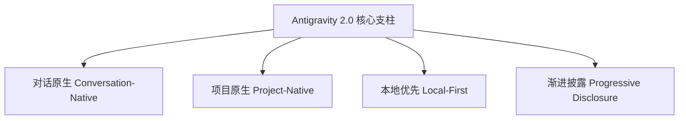

# Google Antigravity 2.0 桌面端设计与 UI/UX 规范手册
> **Google Antigravity 2.0 Desktop Design & UI/UX Specification Guide**
> 
> 本文档旨在深度解构 Google Antigravity 2.0 桌面端的 UI/UX 设计规范，为开发者与设计师提供一套完整、一致且符合产品气质的视觉与交互开发指南。

---

## 1. 核心设计哲学 (Core Design Philosophy)

Antigravity 2.0 并非一个简单的聊天对话框克隆，而是一个**“本地原生、对话驱动的 Agent 协同工作台”**。其设计遵从四大核心支柱：



*   **对话原生 (Conversation-Native)**：对话（Conversation）是应用的第一主轴。用户的提问、Agent 的推理摘要、计划生成、进度更新、执行结果及审批卡片均流动式融入对话中。任务（Tasks）与运行历史（Runs）作为对话的派生物，不得脱离对话单独作为第一主轴界面。
*   **项目原生 (Project-Native)**：界面始终与本地 Workspace 强关联。用户能够一眼感知当前工作的仓库上下文、相关文件改动、生成物状态，营造在“活着的项目文档”中工作的沉浸感，而非在操纵一堆冷冰冰的后台接口。
*   **本地优先 (Local-First) 与安全边界**：强调本地运行的稳定感与安全感。API Key 等机密信息严禁流入 Prompt 或 trace，高风险系统调用默认执行 **“阻断审批 (Fail-closed)”**，前端作为决策交互层，Rust 后端作为绝对的 Policy 裁判官。
*   **渐进式披露 (Progressive Disclosure)**：提供编辑级 (Editorial) 的清爽视效。隐藏无关的运行轨迹和庞大复杂的 JSON 输出，只在用户选择下钻（Drill-down）时才展示 Trace 详情、日志详情或 Raw JSON。

---

## 2. 空间与布局架构 (AppShell & Layout Architecture)

应用界面采用经典的三栏式布局（AppShell），各功能区域按主次层级科学分布：

```text
+------------------------------------------------------------------------------------+
| Top Bar: Workspace Actions              | Layout Controls | Command Palette        |
+------------------------------------------------------------------------------------+
| Left Sidebar      | Center Canvas (聊天主干)                  | Right Context Panel  |
| - Search          | (最大宽度: 820px ~ 980px)                 | - Current Project    |
| - Recent Chats    |                                           | - File References    |
|                   | +---------------------------------------+ | - Active Artifacts   |
| - Home            | | Message / Card                        | | - Decisions Needed   |
| - Conversations   | +---------------------------------------+ | - Next Actions       |
| - Projects        | | Plan / Diff Preview                   | |                      |
| - Artifacts       | +---------------------------------------+ |                      |
| - Agents / Tools  | | Composer (输入框 - 高度: 64~96px)      | |                      |
| - Settings        | +---------------------------------------+ |                      |
+-------------------+-------------------------------------------+----------------------+
| Bottom Activity Rail: Tool Status | Run Status (静默状态指示)                           |
+------------------------------------------------------------------------------------+
```

### 2.1 区域明细规范

*   **顶部工具栏 (Top Bar)**：
    *   承载工作空间快速操作、布局切换按钮（收起/展开边栏与右面板）以及全局命令面板（Command Palette）。
*   **全局左侧边栏 (Left Sidebar - 宽度: `240px` ~ `280px`)**：
    *   作为主要导航轴，背景使用温暖的浅米灰色。
    *   由上至下为：搜索栏、最近对话列表（Recent Conversations，保持轻量无噪声）、核心板块（Home / Conversations / Projects / Artifacts）以及次要管理页入口（Agents / Tools / Settings）。
*   **中央对话画布 (Center Canvas - 最大宽度: `820px` ~ `980px`)**：
    *   主阅读与主操作面，居中对齐，控制最大字符宽度以实现极佳的阅读舒适度。
    *   内部包含对话流、行内执行计划（PlanBlock）、行内进度条、Diff 预览、底部固定 Composer（主控制输入框）。
*   **右侧上下文面板/抽屉 (Right Context Panel - 宽度: `320px` ~ `420px`)**：
    *   定位为**“上下文抽屉”**而非仪表盘。通过 subtle 细线分割，自上而下展示：当前项目名称、文件路径、关联文件卡片列表、当前正被消费/编辑的生成物 (Active Artifact)、待决决策和下一步操作 (Next Actions)。
*   **底部活动栏 (Bottom Activity Rail)**：
    *   显示紧凑的工具调用圆点指示、最近 Trace 状态。在静默状态下绝不能与主聊天 Canvas 争抢视觉重心。

### 2.2 尺寸与空间比率

*   **圆角 (Radius)**：卡片、输入框、按钮等一律采用极小圆角 —— **`8px` 或更小**，塑造精密、机械的工具感。
*   **边距与填充 (Padding & Margin)**：
    *   紧凑排版行间距（Compact row padding）：`8px` ~ `12px`。
    *   内容块内边距（Block padding）：`12px` ~ `18px`。
*   **行高 (Line Height)**：普通正文采用舒适的 **`1.45` ~ `1.65`** 倍行高，代码采用 `1.2` 倍行高。

---

## 3. 颜色体系与 Token 规范 (Color & Design Tokens)

界面使用基于 **“温和中性 (Warm-Neutral)”** 的色调系统，并遵循语义化（Semantic）代号进行组件绑定。**禁止在组件代码内硬编码 Hex/HSL 值**。

### 3.1 核心调色板 Token

| 语义代号 (Token Name) | 色值 (Light Mode) | 色值 (Dark Mode) | 使用场景与视觉规则 |
| :--- | :--- | :--- | :--- |
| `background` / `surface` | `#FFFFFF` | `#1A1917` | 主画布背景，卡片表面底色。平铺时无投影 |
| `sidebar` | `#F7F6F3` | `#131211` | 左侧边栏背景，微弱暖调 |
| `muted` | `#F6F5F4` | `#22201E` | 备用中性背景，非活动卡片背景，小代宽背景 |
| `foreground` | `#1C1B19` | `#E3E1DC` | 首要正文与标题色（柔和黑/柔和白，避免纯黑白） |
| `muted-foreground` | `#615D59` | `#96928D` | 辅助说明字、禁用态字、微弱提示字 |
| `border` | `#E9E8E4` | `#2F2D2A` | 极细边框（Whisper-weight border），绝不刺眼 |
| `input` | `#DCDBD6` | `#3D3B37` | 表单输入控件边框色 |
| `ring` | `#097FE8` | `#1C8BF4` | 键盘聚焦或主输入框激活状态的光晕色 |
| `primary` | `#0075DE` | `#2A93F4` | 主要行动色（蓝），例如 Composer 发送按钮 |
| `accent` | `#2A9D99` | `#3BB2AE` | 辅助强调色（青绿），用于高亮特定的辅助状态 |
| `accent-soft` | `#F2F9FF` | `#142838` | 轻度蓝底，用于 Badge 背景 |
| `badge-foreground` | `#097FE8` | `#4FA5F7` | Badge 文本颜色 |
| `terminal-background` | `#2B2926` | `#1A1917` | 终端组件专用深色背景 |

### 3.2 功能状态色

状态色必须遵循严格的语义规则（UI 内不得使用过多杂乱的状态色，用词须保持一致）：

*   **`success` (绿色 - `#1AE39` / `#22C55E`)**：代表任务完成、校验通过、测试通过。
*   **`warning` (黄色/橙色 - `#DD5B00` / `#F97316`)**：代表等待用户审批、配置缺失、存在潜在风险的操作。
*   **`destructive` (砖红色 - `#D93F3F` / `#EF4444`)**：代表工具执行失败、错误、任务阻断或破坏性动作确认。
*   **`info` (浅灰/浅蓝)**：中性的纯运行态信息展示。

### 3.3 阴影与微光阴影 (Elevation)

*   扁平设计优先。扁平表面（如常规卡片、输入框、面板）**不投射阴影**，仅通过 `#E9E8E4` 边框区分。
*   **悬浮阴影 (`shadow-card`, `shadow-deep`)** 仅用于高对比悬浮或层级叠加元素（如 Modal 弹窗、下拉 Dropdown 菜单、命令面板悬浮层、气泡 Tooltip）。采用多层、极低不透明度的模糊阴影，避免脏、重的感觉：
    ```css
    .shadow-card {
      box-shadow: 0 1px 2px rgba(0,0,0,0.02), 0 4px 12px rgba(0,0,0,0.03);
    }
    ```

---

## 4. 字体与排版规范 (Typography & Hierarchy)

```text
UI 界面字体:   Inter Variable ----------------------> 紧缩字距 (Tracking) & 1.45~1.65行高
等宽代码字体: SF Mono / Menlo / Cascadia Code ------> 1.2 行高 & 字符微调
数据数字排版: tabular-nums ------------------------> 等宽对齐，保证列表整齐
```

*   **UI 字体**：全局搭载 **`Inter` (支持 Variable 属性)**。当系统缺少时，回退至 `system-ui`。
*   **字间距调整 (Letter-Spacing Tracking)**：
    *   大标题（Heading 1, Heading 2 等）必须随着字号变大，缩紧字间距（tightened tracking），提升排版的出版物高级感（Editorial Posture）。
    *   小字号正文采用默认 Tracking。
*   **数字排版**：列表、进度百分比、行号、文件大小、资源开销等数字，一律强制设置 CSS `font-variant-numeric: tabular-nums;`。
*   **等宽代码字体**：代码块与终端内固定使用 `SF Mono`, `Menlo`, `Cascadia Code`, 或 `JetBrains Mono`。

---

## 5. 核心交互模式与 UX 机制 (Key Interactive Patterns)

### 5.1 Composer (主输入框)
Composer 是人机交互最核心的控制器。
*   **输入栏高度**：固定在 `64px` ~ `96px`，支持多行自适应撑高，超出后支持滚动。
*   **下工具栏控制区**：
    *   左侧放置附件夹、`@` 引用、`/` 斜杠命令快捷图标。
    *   右侧放置 **“执行授权控制条” (Per-run Permission Mode)**，用户在发送本次 Prompt 前，可在此处直接设置当前周期的运行授权级别：`Request approval (提示审批)`、`Auto approve (自动同意)`、`Full access (全面授权)`（`Full access` 须带黄色 warning 标识）。

### 5.2 提及菜单与斜杠命令 (Mention & Slash Menu)
*   **命令激发**：键入 `/` 弹出命令菜单，展示可用快捷流（如 `/goal`, `/schedule`, `/browser`），并配有简洁的一句话作用说明。
*   **上下文提及**：键入 `@` 弹出包含“文件与文件夹、先前对话、运行终端、特定规则、MCP 工具”的引用卡片。一旦选定，在输入框中渲染为紧凑、带有小图标、可一键删除的 **上下文芯片 (Chips)**。
*   **交互弹出层**：提及菜单的悬浮窗必须使用 `shadow-deep` 高度阴影，并支持键盘 `↑` `↓` 键 and `Enter` 选择。

### 5.3 页面完备性四状态 (Page States)
所有主要组件和路由视图必须完整设计以下 4 种状态：

1.  **Loading (加载中)**：使用安静的骨架屏 (Skeleton) 或平滑无噪的局部进度条，禁止使用花哨或剧烈摇晃的 Loading 动画。
2.  **Empty (空状态)**：必须说明当前缺失什么数据，并提供一个**明确的行动按钮**（例如：提示“未配置 API Key”，并在下方提供“去配置”的 Primary 按钮）。
3.  **Error (错误态)**：显示一段简洁、不带系统脏代码的人类可读说明。提供“重试 (Retry)”操作，以及一个折叠的“诊断详情 (Diagnostics)”。
4.  **Ready (就绪态)**：数据正常渲染。

---

## 6. 模型矩阵与能力路由配置 UX (Model Settings & Capability Routing)

Antigravity 2.0 支持根据不同的处理能力对底层模型进行动态路由。该设置页面的 UX 必须保证逻辑的直观与高度严谨：

```text
模型设置中心
  ├── 模型矩阵看板 (Model Matrix) ────> 查看与分析各模型规格
  └── 能力路由编辑器 (Capability Routes Panel) ────> 按功能划分绑定模型
```

*   **职责解耦**：主对话框所使用的“主模型（Main Model）”与底层的“能力模型路由”是独立的。用户可以在主界面切换主对话模型，而在设置中配置具体能力的路由。
*   **概念区分**：
    *   **Image Input**：描述主模型是否接受图像附件。
    *   **Image Generation**：描述用于生产新图像的路由服务（例如绑定特定的专有图像生成模型）。
*   **路由配置的限制规则**：
    *   路由卡片/表格以 `CapabilityRouteKind` 进行分组。
    *   **动态控制**：只有当后端返回的路由选项属性 `runtimeSupported === true` 时，该选项在 UI 中才是可选的。不支持的选项应以禁用（Disabled）状态呈现，并附带 backend 提供的不可用原理解释。
    *   **禁止硬编码推断**：前端组件严禁通过本地配置文件或 Provider Catalog 静态数据来推断运行时是否支持某模型，一切以 Rust 后端返回的动态信息为准。
    *   **声学能力**：语音转文字 (`speech_to_text`) 功能卡片仅在后端存在可用引擎时才渲染。

---

## 7. 安全与审批控制 (Security & Consent UX)

安全交互遵循 **“默认Fail-closed，高风险高提醒，极高风险需打字”** 的阶梯控制原则：

```text
[低/中风险] ──> 标准 Approve / Deny 卡片
[高 风 险] ──> 显式行动按钮 (例如: "Approve Write") + 详细的 Diff / 命令折叠栏
[危险操作] ──> 输入框打字校验 (例如: 手动键入 "CONFIRM DESTROY")
```

### 7.1 风险级别 (Risk Level) 与 UI 呈现
*   `low`（如只读文件）：系统在对话流中生成一个静默的小卡片，展示已读取文件路径，用户可回溯。
*   `medium`（如写入/修改文件、外网请求）：在输入框上方或对话流中中断，展示改动的 `DiffViewer`，用户确认后方可继续。
*   `high` / `critical`（如运行破坏性 shell 指令、删除文件）：触发强制全局弹窗 `PermissionDialog`，审批按钮禁用默认 focus（防止误触回车确认），且破坏性按钮使用警告红色 (`destructive`)。

### 7.2 密钥与敏感信息防泄漏 (Secret Redaction)
*   界面上显示的任何 API Key 等机密数据，一旦保存，**严禁再次回显明文**。仅以 `••••••••` 或秘钥引用（Ref）的形式展示。
*   日志、Trace、Raw JSON 视图在输出到 UI 渲染前，必须经过 Rust 后端或前端的 Redactor（敏感词消除器）净化，界面上绝对不能出现未脱敏的 Secrets。

---

## 8. 核心特化组件设计准则 (Key Special Components)

### 8.1 生成物预览组件 (`ArtifactPreview`)
*   **呈现形式**：在对话中生成时以精美的卡片展现，包含生成物类型、状态徽章 (Badge)、版本号以及一句话摘要。
*   **右侧承载**：点击卡片可在右侧“上下文面板”中全屏渲染该 Artifact。
*   **交互支持**：支持版本对比、支持直接展示 HTML/JS 渲染成果、支持一键 “Proceed”（执行）或向 Agent 回传 “Request Feedback”（请求反馈）。

### 8.2 差异对比组件 (`DiffViewer`)
*   **设计基准**：禁止直接渲染原始 diff 字符串。需具备语法高亮 (Syntax-aware display) 或简洁的逐行 `+` (添加) 和 `-` (删除) 差异对照。
*   **防爆舱策略**：面对超过 200 行的超大 Diff，必须默认截断并显示“查看完整 Diff 补丁”的可折叠操作，防止超长文本撑爆对话滚动条。

### 8.3 工具调用卡片 (`ToolCallCard`)
*   **禁止裸露 JSON**：不能直接把工具调用的 Raw Input/Output JSON 扔在聊天里。
*   **信息层级**：
    1.  首行：展示工具名称（带类型图标）、工具当前状态 (Badge)、调用耗时（如 `120ms`）。
    2.  第二层：展示输入参数摘要（如：`read_file: /path/to/main.py`）。
    3.  折叠区（默认收起）：可以点击展开查看完整的脱敏 Raw JSON 输入输出与错误调用详情。

### 8.4 执行计划块 (`PlanBlock`)
*   **行内嵌入**：Agent 在开始工作前输出的规划以 inline 卡片嵌在对话中，采用折叠结构。
*   **符号标记**：使用 `- [ ]` (未完成)、`- [/]` (执行中)、`- [x]` (已完成) 标记任务进度。
*   **极简原则**：不引入繁重的甘特图或复杂的独立看板面板，完全融入叙事文档结构中。

### 8.5 重放调试组件 (`Replay & Activity UX`)
*   **事件顺序**：重放历史流程时，UI 渲染必须严格遵循原始 Trace 事件的时序。
*   **重放标记**：处于重放阶段的运行卡片，必须带有醒目的 `Replayed`（已重放）水印或徽章。
*   **工具锁定**：在 Replay 过程中，**严禁**自动再次触发任何具有破坏性、外部请求性质或本地写权限的工具调用，除非用户在界面中显式开启了特定的“可执行重放调试模式”。

---

## 9. 性能与无障碍体验规范 (Performance & Accessibility)

### 9.1 长列表虚拟化
*   **大文本与大列表**：为了防止长对话流导致 DOM 节点过多引起的渲染卡顿，长对话与日志组件必须使用虚拟滚动库（如 `TanStack Virtual`）。
*   **高度估算**：对于可变高度的聊天对话框卡片，必须配置稳定的估算高度，并在加载完成时动态测算以防滚动闪烁。
*   **排版测速**：在处理非常长的大型纯文本块排版渲染时，建议使用专门的测量工具进行测宽定位，防止出现布局重排抖动。

### 9.2 无障碍设计 (A11y)
*   **键盘焦点闭环 (Focus Trap)**：所有 Dialog 弹窗和 Permission 审批确认浮层在弹出时，焦点必须自动被锁定在内部（Focus Trap），当关闭或按下 ESC 时，焦点需原路恢复（Restore Focus）到原本的触发按钮上。
*   **状态的色彩冗余**：所有的状态点（如成功、警告、危险、就绪）**不能仅仅通过颜色区分**，必须辅以明确的图形图标（Lucide 图标）或文字标签，保障色弱或色盲用户的无障碍使用。
*   **键盘定位**：交互按钮和输入芯片必须完全支持键盘 Tab 键循环定位。

---

## 10. 术语与语言禁忌 (Terminology & UX Copy Taboos)

为了给用户营造“自然、平静”的非开发人员隔离感，界面文字和文案应当隐藏软件工程术语，严禁使用“程序员内部行话”：

| 禁用词汇 (Taboo Terms) | 推荐替代词汇 (Recommended Terms) | 规避原因 |
| :--- | :--- | :--- |
| `Router` / `Capability Router` | `Settings` / `Capability Mapping` / `Routing` | 避免使用过于偏向底层的网络路由名词，降低理解难度 |
| `Query Cache` / `Redis` | `Memory` / `History` | 缓存是开发实现的细节，对用户而言仅需体现为“记忆”或“历史记录” |
| `Reducer` / `Store` / `State` | `Context` / `State View` | 状态机/Reducer 是 React/Redux 实现用语，不得暴露在前端 UI 描述中 |
| `Sandbox Container` | `Sandbox` / `Restricted Terminal` | 隐藏过于复杂的容器概念，直接告知其是一个安全的沙箱环境 |
| `Provider Profile` | `Model Service` / `Provider` | 避免无意义的 Profile 名词叠加 |

---

## 11. 开发自检清单 (Design Verification Checklist)

在进行任何前端样式开发和合并前，请核对以下条目是否全部满足：

*   [ ] **Token 绑定**：是否完全使用了语义化颜色 Token（如 `bg-surface`, `border-border`），没有任何写死的 Hex 或 HSL 颜色值？
*   [ ] **四状态完备**：该组件是否已经设计并测试了 `loading`, `empty`, `error`, `ready` 四种表现？
*   [ ] **圆角与边框**：圆角是否保持在 `8px` 及以下？非浮空卡片是否去除了 shadow？
*   [ ] **脱敏处理**：界面输出的日志或 Raw JSON 是否有暴露 secrets 的可能？
*   [ ] **数字等宽**：展示表格数字、行号或 Trace 耗时时，是否开启了 `tabular-nums`？
*   [ ] **键盘可访问**：交互弹层或对话框是否可以通过键盘 `ESC` 关闭，是否配置了焦点捕获？
