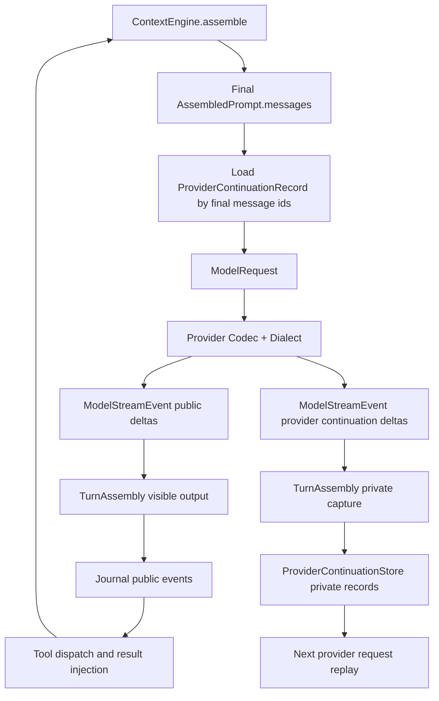

# Provider Continuation Runtime Architecture Implementation Plan

> **For agentic workers:** REQUIRED SUB-SKILL: Use `superpowers:subagent-driven-development` or `superpowers:executing-plans` to implement this plan task-by-task. Steps use checkbox (`- [ ]`) syntax for tracking. Each task requires a pre-task implementation analysis and a read-only subagent audit before the task can be marked complete.

**Goal:** Refactor Jyowo model runtime so multi-provider model capabilities, provider wire dialects, and private provider continuation state are explicit, testable, and isolated from public conversation state.

**Architecture:** Keep Agent Harness Engine as the orchestration loop. Move provider-specific request and response semantics into model runtime semantics, provider codecs, dialects, and a private provider continuation store. Public transcript, execution trace, and provider continuation state must be separate data planes with separate persistence and exposure rules.

**Tech Stack:** Rust 1.96, serde, serde_json, schemars, Tokio, reqwest, JSONL or SQLite local persistence, Tauri 2, React 19, TypeScript 6, Zod, Vitest, cargo test, pnpm gates.

---

## Required Execution Mode

Implementation must happen in an isolated git worktree. Do not implement this plan in the original `main` workspace.

Use branch prefix `goya`.

Before creating the implementation worktree, verify the plan document is present in `main` history:

```bash
git show main:docs/plans/2026-07-02-provider-continuation-runtime-architecture-implementation.md >/dev/null
```

Expected: exit code 0.

If this command fails, stop. The plan has not been committed to `main`, and the isolated worktree will not contain it.

```bash
git status --short --branch
git worktree add ../Jyowo-provider-continuation-runtime -b goya/provider-continuation-runtime
cd ../Jyowo-provider-continuation-runtime
git status --short --branch
```

Expected:

```text
## goya/provider-continuation-runtime
```

If the branch name already exists:

```bash
git worktree add ../Jyowo-provider-continuation-runtime-2 -b goya/provider-continuation-runtime-2
```

All commits for this plan must be created from the isolated worktree path.

The plan document itself is intentionally committed on `main`. Implementation work must start from the isolated worktree created above.

## Required Execution Model

Use `GPT-5.5 Pro` with `xhigh` reasoning, or the highest available equivalent configured for the execution environment.

If the execution environment cannot select that model or reasoning level, the implementation agent must report the limitation before Task 0. It must not silently claim a model switch.

## Mandatory Reading

Before Task 0, read these files in the isolated worktree:

```text
AGENTS.md
docs/testing/testing-strategy.md
docs/frontend/agent-harness-frontend-development-guidelines.md
docs/frontend/frontend-product-ux.md
docs/frontend/frontend-engineering.md
docs/frontend/frontend-quality.md
docs/design2/antigravity_2_0_design_system_specification.md
docs/backend/agent-harness-backend-development-guidelines.md
docs/backend/backend-runtime.md
docs/backend/backend-engineering.md
docs/backend/backend-quality.md
docs/architecture/harness/crates/harness-model.md
docs/plans/2026-07-02-provider-continuation-runtime-architecture-implementation.md
```

Before any task that touches frontend files, reread the frontend docs above.

Before any task that touches backend files, reread the backend docs above and `docs/testing/testing-strategy.md`.

## Current Code Facts

Use these facts as the baseline. Do not invent a different starting state.

- `crates/jyowo-harness-contracts/src/model_capability.rs` owns the current public `ConversationModelCapability`.
- `crates/jyowo-harness-model/src/provider.rs` defines `ModelProvider`, `ModelDescriptor`, `ModelRuntimeSnapshot`, `ModelRequest`, `ModelStreamEvent`, `ContentDelta`, and `ThinkingDelta`.
- `ModelRequest` currently contains public transcript inputs only: `model_id`, `messages`, `tools`, `system`, sampling fields, `cache_breakpoints`, `protocol`, and `extra`.
- `ModelStreamEvent` currently has public stream events only. It has no private provider continuation event.
- `crates/jyowo-harness-model/src/openai_compatible/mod.rs` builds Chat Completions and Responses request bodies.
- `crates/jyowo-harness-model/src/openai_compatible/streaming.rs` parses Chat Completions SSE chunks. `StreamDelta` currently parses `content` and `tool_calls`, not provider continuation fields.
- `crates/jyowo-harness-model/src/deepseek.rs`, `minimax.rs`, `qwen.rs`, `doubao.rs`, `zhipu.rs`, `openrouter.rs`, and `local_llama.rs` use the OpenAI-compatible client path.
- `crates/jyowo-harness-engine/src/turn.rs` owns the main loop, prompt assembly, model request creation, stream aggregation, assistant text accumulation, and tool dispatch.
- `crates/jyowo-harness-engine/src/result_inject.rs` builds assistant tool messages from visible text and tool calls.
- `crates/jyowo-harness-context/src/prompt.rs` defines `AssembledPrompt`.
- `crates/jyowo-harness-context/src/engine.rs` can compact or rewrite final assembled messages before a model call.
- Desktop runtime creates durable runtime files under `.jyowo/runtime`.
- `apps/desktop/src-tauri/src/commands/runtime.rs` is a correct desktop assembly point for runtime stores.
- `crates/jyowo-harness-sdk/src/builder.rs` and `crates/jyowo-harness-engine/src/engine.rs` are the correct facade and engine injection points.
- There is no `crates/jyowo-harness-provider-state` crate yet.
- There is no `docs/architecture/harness/crates/harness-provider-state.md` yet.
- `crates/jyowo-harness-engine/src/lib.rs` references `docs/architecture/harness/crates/harness-engine.md`, but that architecture document is absent in the current tree.

## Observed Bug Contract

DeepSeek failure in desktop:

```text
invalid request: The reasoning_content in the thinking mode must be passed back to the API.
```

Facts from the failing run:

- The first DeepSeek model call succeeds.
- DeepSeek emits an assistant message with a tool call.
- Jyowo executes the tool call.
- The second DeepSeek request fails because the OpenAI-compatible adapter replays the assistant tool-call message without DeepSeek's private `reasoning_content`.
- MiniMax succeeds through the same OpenAI-compatible client path because its dialect does not require private reasoning replay.
- MiniMax is not a separate implementation path for this behavior.

Root cause:

```text
provider-private continuation state is currently conflated with public conversation messages, then lost because public MessagePart does not preserve provider-private replay fields.
```

## Target Data Planes

The implementation must keep these three state planes separate.

| Plane | Owns | Visible To Frontend | Stored In Journal | May Contain Provider Private Replay |
|---|---|---:|---:|---:|
| Conversation Transcript | user text, assistant visible text, tool calls, tool results | yes | yes | no |
| Execution Trace | permissions, tools, hooks, usage, errors, run lifecycle | yes after redaction | yes | no |
| Provider Continuation State | provider-private replay payload needed for next provider request | no | no | yes |

DeepSeek `reasoning_content` belongs only to Provider Continuation State.

It must never be stored in:

```text
MessagePart::Text
MessagePart::Thinking
Event
Journal
Replay
logs
traces
frontend state
Zod payloads
screenshots
export files
snapshots
```

## Target Architecture

```text
ContextEngine assembles final prompt
  -> Engine resolves continuation keys from final AssembledPrompt.messages
  -> ProviderContinuationStore loads private records
  -> ModelRequest carries public messages plus private continuation context
  -> ModelProvider delegates to protocol codec
  -> codec applies provider dialect rules
  -> provider response stream emits public content events and private continuation events
  -> TurnAssembly builds visible assistant output and captures private continuation records
  -> Engine emits public events only
  -> Engine stores provider continuation records outside Journal
  -> Engine dispatches tools
  -> Engine injects public tool results
  -> next iteration repeats with final assembled prompt
```

Mermaid source:



## Target Design Contracts

### Public capability remains a projection

Keep `ConversationModelCapability` public and simple. It is for UI, user-facing model selection, and high-level routing.

It must not grow provider-private fields.

Runtime decisions use internal semantics:

```rust
#[derive(Debug, Clone, PartialEq, Eq)]
pub struct ModelRuntimeSemantics {
    pub protocol: ModelProtocol,
    pub tool_protocol: ToolProtocolSemantics,
    pub reasoning_protocol: ReasoningProtocolSemantics,
    pub streaming_protocol: StreamingProtocolSemantics,
    pub cache_protocol: CacheProtocolSemantics,
    pub media_protocol: MediaProtocolSemantics,
    pub output_protocol: OutputProtocolSemantics,
}
```

Required enums:

```rust
#[derive(Debug, Clone, PartialEq, Eq)]
pub enum ToolProtocolSemantics {
    None,
    OpenAiChatTools,
    OpenAiResponsesTools,
    AnthropicTools,
    GeminiTools,
    BedrockConverseTools,
}

#[derive(Debug, Clone, PartialEq, Eq)]
pub enum ReasoningProtocolSemantics {
    None,
    PublicThinking,
    PublicSummary,
    ProviderPrivateReplay {
        continuation_kind: ProviderContinuationKind,
        required_for_assistant_tool_replay: bool,
    },
}

#[derive(Debug, Clone, PartialEq, Eq)]
pub enum StreamingProtocolSemantics {
    None,
    Sse,
    JsonLines,
    ProviderNative,
}

#[derive(Debug, Clone, PartialEq, Eq)]
pub enum CacheProtocolSemantics {
    None,
    OpenAiAuto,
    AnthropicEphemeral,
    GeminiContextCache,
}

#[derive(Debug, Clone, PartialEq, Eq)]
pub enum MediaProtocolSemantics {
    TextOnly,
    OpenAiContentParts,
    ProviderNative,
}

#[derive(Debug, Clone, PartialEq, Eq)]
pub enum OutputProtocolSemantics {
    Text,
    TextAndToolUse,
    StructuredJson,
}
```

### Provider state owns private continuation records

Add a new L1 crate:

```text
crates/jyowo-harness-provider-state
```

Core record:

```rust
#[derive(Debug, Clone, PartialEq, Serialize, Deserialize)]
#[serde(deny_unknown_fields, rename_all = "camelCase")]
pub struct ProviderContinuationRecord {
    pub provider_id: String,
    pub model_config_id: Option<String>,
    pub protocol: ModelProtocol,
    pub dialect: String,
    pub tenant_id: TenantId,
    pub session_id: SessionId,
    pub producing_run_id: RunId,
    pub message_id: MessageId,
    pub scope: ProviderContinuationScope,
    pub kind: ProviderContinuationKind,
    pub payload: serde_json::Value,
    pub created_at: chrono::DateTime<chrono::Utc>,
}
```

Required supporting types:

```rust
#[derive(Debug, Clone, Copy, PartialEq, Eq, Hash, Serialize, Deserialize)]
#[serde(rename_all = "snake_case")]
pub enum ProviderContinuationScope {
    Conversation,
    Run,
}

#[derive(Debug, Clone, PartialEq, Eq, Hash, Serialize, Deserialize)]
#[serde(rename_all = "snake_case")]
pub enum ProviderContinuationKind {
    ReasoningReplay,
    ToolReplay,
    CacheReplay,
    ProviderNative(String),
}

#[derive(Debug, Clone, PartialEq, Eq)]
pub struct ProviderContinuationQuery {
    pub provider_id: String,
    pub model_config_id: Option<String>,
    pub protocol: ModelProtocol,
    pub dialect: String,
    pub tenant_id: TenantId,
    pub session_id: SessionId,
    pub message_ids: Vec<MessageId>,
    pub kinds: Vec<ProviderContinuationKind>,
}
```

Required store trait:

```rust
#[async_trait::async_trait]
pub trait ProviderContinuationStore: Send + Sync + 'static {
    async fn load_for_messages(
        &self,
        query: ProviderContinuationQuery,
    ) -> Result<Vec<ProviderContinuationRecord>, ProviderContinuationStoreError>;

    async fn append_batch(
        &self,
        records: Vec<ProviderContinuationRecord>,
    ) -> Result<(), ProviderContinuationStoreError>;

    async fn prune_session(
        &self,
        tenant_id: TenantId,
        session_id: SessionId,
    ) -> Result<(), ProviderContinuationStoreError>;
}
```

Store path for desktop:

```text
.jyowo/runtime/provider-continuations.jsonl
```

The lower crate must not hardcode desktop command state. The SDK or desktop runtime assembly passes the opened store to the Engine.

### Provider dialects own wire quirks

OpenAI-compatible providers must not be represented as one behavior blob.

Target modules:

```text
crates/jyowo-harness-model/src/openai_compatible/client.rs
crates/jyowo-harness-model/src/openai_compatible/chat_codec.rs
crates/jyowo-harness-model/src/openai_compatible/responses_codec.rs
crates/jyowo-harness-model/src/openai_compatible/dialect.rs
crates/jyowo-harness-model/src/openai_compatible/continuation.rs
crates/jyowo-harness-model/src/openai_compatible/request.rs
crates/jyowo-harness-model/src/openai_compatible/streaming.rs
crates/jyowo-harness-model/src/openai_compatible/error.rs
crates/jyowo-harness-model/src/openai_compatible/mod.rs
```

Target dialect enum:

```rust
#[derive(Debug, Clone, Copy, PartialEq, Eq)]
pub enum OpenAiChatDialect {
    Plain,
    MiniMax,
    DeepSeek,
    Qwen,
    Doubao,
    Zhipu,
    Kimi,
    OpenRouter,
    LocalLlama,
}
```

The Engine must not contain provider-private field names such as `reasoning_content`.

The only production code allowed to mention DeepSeek's wire field is the OpenAI-compatible DeepSeek dialect codec and its tests.

### Engine owns orchestration only

Extract behavior-preserving stream handling from `run_turn` into `TurnAssembly`.

Target module:

```text
crates/jyowo-harness-engine/src/turn_assembly.rs
```

Target shape:

```rust
#[derive(Debug, Default)]
pub(crate) struct TurnAssembly {
    pub(crate) assistant_message_id: MessageId,
    pub(crate) visible_text: String,
    pub(crate) tool_calls: Vec<ToolCall>,
    pub(crate) provider_continuations: Vec<ProviderContinuationRecord>,
    pub(crate) model_call_usage: UsageSnapshot,
    pub(crate) stop_reason: StopReason,
}
```

`TurnAssembly` may route public deltas into events and collect private continuations. It must not interpret provider-specific payload fields.

### Continuation lookup uses final assembled messages

This is mandatory.

Use `assembled.messages` after ContextEngine assembly and after any proactive or emergency compaction. Do not key continuation lookup from `working_messages`.

Rules:

- If compaction removes an assistant message, do not load its continuation.
- If compaction replaces history with a summary, do not transfer continuation to the summary.
- If a provider requires continuation for an assistant tool-call replay and the final assembled assistant message has no matching record, fail closed before sending the provider request.
- A missing continuation for providers that do not require private replay must not fail the request.

## Destructive Refactor Policy

Destructive refactoring is allowed when it removes provider-specific branches from Engine, prevents private-state leaks, or replaces a compatibility wrapper with a clearer module boundary.

Allowed:

- Splitting large modules such as `openai_compatible/mod.rs`.
- Moving Chat Completions request mapping into a codec module.
- Moving stream aggregation responsibilities out of `run_turn`.
- Deleting compatibility helpers after all call sites move to the new API.

Forbidden:

- Keeping old request builders as parallel compatibility paths after the codec is complete.
- Adding provider-specific checks to Engine.
- Adding provider-private fields to `MessagePart`, public events, frontend state, or public schemas.
- Returning canned provider responses in production code.
- Using string matching in Engine to infer provider behavior.

## No Fake Implementation Rule

Production behavior must use real runtime paths.

Allowed test fixtures:

- Temporary directories.
- Real file stores opened in temporary directories.
- In-process HTTP test servers that capture actual provider request bodies.
- Minimal provider response fixtures shaped from provider wire format.
- Test-only fake `ModelProvider` implementations inside Rust test modules when they exercise Engine behavior and do not ship as runtime providers.

Forbidden:

- Production fake provider implementations.
- Hardcoded successful DeepSeek or MiniMax responses.
- UI data that pretends runtime support exists without backend state.
- Tests that bypass codec/request-body generation and assert a manually built JSON value.
- Leaving placeholder branches for future providers.

## Per-Task Required Gates

Every task must follow this protocol:

1. **Pre-task analysis gate:** before editing, write a short task analysis in the execution thread with:
   - task goal
   - files to modify
   - invariants that must remain true
   - tests to add or update
   - commands to run
   - explicit non-goals
2. **Implementation:** edit only files listed in the task, unless the pre-task analysis names a discovered file and explains why.
3. **Verification:** run the task-specific command list.
4. **Read-only subagent audit:** dispatch a subagent with read-only instructions:
   - inspect the task diff
   - compare it to the task goal
   - cite exact files and lines
   - verify tests and gates were run
   - return `PASS` or `FAIL`
5. **Fix audit failures:** if audit returns `FAIL`, fix and rerun task verification and audit.
6. **Commit:** commit the task from the isolated worktree with a focused message.

Audit prompt template:

```text
You are a read-only implementation auditor.
Task: <task number and title>
Plan file: docs/plans/2026-07-02-provider-continuation-runtime-architecture-implementation.md
Inspect the current diff and relevant source files.
Verify:
1. The task goal is implemented.
2. No provider-private continuation data is exposed through MessagePart, Event, Journal, frontend state, logs, traces, screenshots, exports, or snapshots.
3. No mock data, production fake provider, or hardcoded success path was introduced.
4. Required tests and gates ran and match the task.
5. Implementation follows Jyowo layer rules.
Return PASS or FAIL with file:line evidence.
Do not edit files.
```

## Task 0: Isolated Worktree And Baseline

**Files:**

- Read: `AGENTS.md`
- Read: docs listed in Mandatory Reading
- Modify: none

**Goal:** Start from a clean isolated worktree and record the baseline state before implementation.

- [ ] **Pre-task analysis gate**

  State the worktree path, branch name, expected baseline commands, and non-goal: no source edits in Task 0.

- [ ] **Create and enter the isolated worktree**

  Run from the original repository:

  ```bash
  git show main:docs/plans/2026-07-02-provider-continuation-runtime-architecture-implementation.md >/dev/null
  git status --short --branch
  git worktree add ../Jyowo-provider-continuation-runtime -b goya/provider-continuation-runtime
  cd ../Jyowo-provider-continuation-runtime
  git status --short --branch
  ```

  Expected branch:

  ```text
  ## goya/provider-continuation-runtime
  ```

- [ ] **Read mandatory files**

  Use `sed`, `rg`, or the editor to read every mandatory file listed above.

- [ ] **Run baseline docs gate**

  ```bash
  pnpm check:docs
  ```

  Expected: exit code 0.

- [ ] **Read-only subagent audit**

  Use the audit prompt template. The auditor must confirm no implementation files were edited.

- [ ] **Commit**

  No commit is required for Task 0 if there are no changes.

## Task 1: Architecture Documents And Layer Rules

**Files:**

- Modify: `docs/backend/backend-engineering.md`
- Modify: `docs/architecture/harness/crates/harness-model.md`
- Create: `docs/architecture/harness/crates/harness-provider-state.md`
- Create: `docs/architecture/harness/crates/harness-engine.md`
- Test: docs gates

**Goal:** Lock the target boundaries into repository docs before code changes.

- [ ] **Pre-task analysis gate**

  State the exact layer change, why `jyowo-harness-provider-state` is L1, why Engine stays L3, and why public `ConversationModelCapability` is only a projection.

- [ ] **Update backend layer table**

  Add `jyowo-harness-provider-state` to the L1 package table in `docs/backend/backend-engineering.md`.

  Required wording:

  ```text
  `jyowo-harness-provider-state` owns private provider continuation persistence and lookup. It stores provider-private replay payloads outside Journal, Replay, logs, traces, frontend state, and public serde contracts.
  ```

  Add a rule under backend engineering:

  ```text
  Provider continuation rules:
  - provider-private continuation payloads are never public events.
  - Engine may load and store opaque continuation records, but must not inspect provider-private wire fields.
  - Provider codecs may interpret continuation payloads for their own dialect.
  - Continuation lookup keys must come from final assembled prompt messages after compaction.
  - Missing required continuation fails closed before provider request dispatch.
  ```

- [ ] **Update harness-model architecture doc**

  In `docs/architecture/harness/crates/harness-model.md`, add:

  ```text
  `jyowo-harness-model` owns provider protocol codecs and runtime semantics.
  It may consume opaque provider continuation records when building provider requests.
  It must not persist continuation state.
  It must not expose private continuation payloads as MessagePart, public events, logs, traces, or frontend payloads.
  ```

  Add OpenAI-compatible dialect rules:

  ```text
  OpenAI-compatible providers share transport and broad protocol shape, but do not share identical dialect semantics.
  DeepSeek, MiniMax, Qwen, Doubao, Zhipu, Kimi, OpenRouter, and Local Llama must be represented through explicit dialect configuration.
  ```

- [ ] **Create provider-state architecture doc**

  Create `docs/architecture/harness/crates/harness-provider-state.md` with:

  ```markdown
  # harness-provider-state

  `jyowo-harness-provider-state` owns private provider continuation persistence.

  ## Scope

  The crate stores opaque provider continuation records needed to replay future provider requests.
  Examples include provider-private reasoning replay payloads, provider-native cache replay handles, and dialect-specific replay metadata.

  It does not own public messages, public events, Journal, Replay, frontend payloads, provider HTTP clients, credentials, permission decisions, or prompt assembly.

  ## Layer

  This is an L1 runtime primitive.
  It depends on `jyowo-harness-contracts` and third-party serialization/storage crates only.
  It must not depend on Engine, SDK, desktop shell, provider clients, Journal, Context, Tool, Permission, or frontend code.

  ## Privacy

  Provider continuation payloads are private.
  They must not be written to public events, logs, traces, screenshots, snapshots, support bundles, frontend state, or exported transcripts.

  ## Lookup

  Continuation lookup is keyed by provider id, model config id, protocol, dialect, tenant id, session id, final prompt message ids, and continuation kind.
  Final prompt message ids means the ids after ContextEngine assembly and compaction.
  ```

- [ ] **Create harness-engine architecture doc**

  Create `docs/architecture/harness/crates/harness-engine.md` with:

  ```markdown
  # harness-engine

  `jyowo-harness-engine` owns run orchestration, model/tool loop, budgets, public event emission, and runtime coordination.

  ## Scope

  Engine assembles prompts through ContextEngine, calls ModelProvider, dispatches tools, applies permissions, emits public events, and records usage.

  Engine may load and store opaque ProviderContinuationRecord values.
  Engine must not interpret provider-private payload fields.

  ## Turn Assembly

  Turn assembly converts model stream events into visible assistant text, tool calls, usage, stop reason, and private provider continuation captures.
  Only public text, tool calls, tool results, usage, errors, and lifecycle events may enter Journal.

  ## Provider Continuation

  Continuation lookup uses final AssembledPrompt messages.
  If compaction removes an assistant message, its continuation is not loaded.
  If a provider requires a continuation for assistant tool replay and the record is absent, Engine fails closed before dispatching the provider request.
  ```

- [ ] **Run docs gates**

  ```bash
  pnpm check:docs
  pnpm check:backend-docs
  ```

  Expected: both exit code 0.

- [ ] **Read-only subagent audit**

  Audit must confirm docs contain the layer rule, privacy rule, final-message lookup rule, and fail-closed rule.

- [ ] **Commit**

  ```bash
  git add docs/backend/backend-engineering.md docs/architecture/harness/crates/harness-model.md docs/architecture/harness/crates/harness-provider-state.md docs/architecture/harness/crates/harness-engine.md
  git commit -m "docs: define provider continuation architecture"
  ```

## Task 2: Provider Continuation State Crate

**Files:**

- Modify: `Cargo.toml`
- Create: `crates/jyowo-harness-provider-state/Cargo.toml`
- Create: `crates/jyowo-harness-provider-state/src/lib.rs`
- Create: `crates/jyowo-harness-provider-state/tests/provider_continuation_store.rs`
- Test: `cargo test -p jyowo-harness-provider-state`

**Goal:** Add the L1 crate that owns private continuation persistence and query semantics.

- [ ] **Pre-task analysis gate**

  State the storage format, trait shape, error type, no-public-event invariant, and why this crate has no dependency on Engine, Model, Journal, SDK, or desktop shell.

- [ ] **Add workspace member**

  Add this member to root `Cargo.toml`:

  ```toml
  "crates/jyowo-harness-provider-state",
  ```

- [ ] **Create crate manifest**

  Required dependencies:

  ```toml
  [package]
  name = "jyowo-harness-provider-state"
  version.workspace = true
  edition.workspace = true
  license.workspace = true
  publish = false
  rust-version.workspace = true

  [lib]
  name = "harness_provider_state"
  path = "src/lib.rs"
  doctest = false

  [lints]
  workspace = true

  [dependencies]
  jyowo-harness-contracts = { path = "../jyowo-harness-contracts" }
  async-trait.workspace = true
  chrono.workspace = true
  serde.workspace = true
  serde_json.workspace = true
  thiserror.workspace = true
  tokio.workspace = true

  [dev-dependencies]
  tempfile.workspace = true
  ```

  Preserve workspace lint settings used by existing crates.

- [ ] **Implement public crate API**

  Implement:

  ```rust
  #![forbid(unsafe_code)]

  pub struct ProviderContinuationRecord { ... }
  pub enum ProviderContinuationScope { Conversation, Run }
  pub enum ProviderContinuationKind { ReasoningReplay, ToolReplay, CacheReplay, ProviderNative(String) }
  pub struct ProviderContinuationQuery { ... }
  pub enum ProviderContinuationStoreError { ... }
  pub trait ProviderContinuationStore { ... }
  pub struct FileProviderContinuationStore { ... }
  ```

  File store requirements:

  - `FileProviderContinuationStore::open(workspace_root)` creates `.jyowo/runtime`.
  - Records are appended to `.jyowo/runtime/provider-continuations.jsonl`.
  - `load_for_messages` returns only records matching every query dimension.
  - If multiple records match the same `(message_id, kind)`, return the newest by `created_at`.
  - Invalid JSONL lines fail closed with `ProviderContinuationStoreError::CorruptRecord`.
  - `append_batch` rejects records whose payload is `null`.
  - `prune_session` removes records for the exact `(tenant_id, session_id)` and preserves other sessions.

- [ ] **Write store tests first**

  Required tests in `tests/provider_continuation_store.rs`:

  ```rust
  #[tokio::test]
  async fn file_store_round_trips_private_records_by_final_message_ids() { ... }

  #[tokio::test]
  async fn file_store_does_not_return_records_for_other_provider_or_dialect() { ... }

  #[tokio::test]
  async fn file_store_keeps_newest_record_per_message_and_kind() { ... }

  #[tokio::test]
  async fn file_store_rejects_null_payload() { ... }

  #[tokio::test]
  async fn corrupt_jsonl_fails_closed() { ... }

  #[tokio::test]
  async fn prune_session_only_removes_matching_session() { ... }
  ```

- [ ] **Run crate tests**

  ```bash
  cargo test -p jyowo-harness-provider-state
  ```

  Expected: exit code 0.

- [ ] **Run docs gate**

  ```bash
  pnpm check:backend-docs
  ```

  Expected: exit code 0.

- [ ] **Read-only subagent audit**

  Audit must confirm the new crate has no dependency on Engine, Model, Journal, SDK, desktop shell, or frontend code.

- [ ] **Commit**

  ```bash
  git add Cargo.toml crates/jyowo-harness-provider-state
  git commit -m "feat: add provider continuation state store"
  ```

## Task 3: Internal Model Runtime Semantics

**Files:**

- Modify: `crates/jyowo-harness-model/Cargo.toml`
- Modify: `crates/jyowo-harness-model/src/provider.rs`
- Modify: provider descriptor files under `crates/jyowo-harness-model/src/*.rs`
- Create: `crates/jyowo-harness-model/tests/runtime_semantics.rs`
- Test: `cargo test -p jyowo-harness-model runtime_semantics`

**Goal:** Add internal runtime semantics without expanding public conversation capability.

- [ ] **Pre-task analysis gate**

  State which public structs remain unchanged for frontend use, which internal structs are added, and how DeepSeek differs from MiniMax.

- [ ] **Add dependency on provider-state**

  `jyowo-harness-model` may depend on `jyowo-harness-provider-state` for continuation value types.

  Dependency rule:

  ```text
  harness-provider-state -> harness-contracts only
  harness-model -> harness-provider-state allowed
  harness-provider-state must never depend on harness-model
  ```

- [ ] **Add semantics types**

  Add the `ModelRuntimeSemantics` and enum types described in Target Design Contracts to `provider.rs` or a focused `runtime_semantics.rs` module exported from `lib.rs`.

- [ ] **Extend descriptors and snapshots**

  Add:

  ```rust
  pub runtime_semantics: ModelRuntimeSemantics,
  ```

  to `ModelDescriptor`, `ModelRuntimeSnapshot`, and `ModelInventoryEntry` if inventory needs runtime semantics for validation.

  `ModelRuntimeSnapshot::from_descriptor` must preserve the field.

- [ ] **Default semantics**

  Add constructors:

  ```rust
  impl ModelRuntimeSemantics {
      pub fn messages_default(protocol: ModelProtocol) -> Self { ... }
      pub fn openai_chat_plain() -> Self { ... }
      pub fn openai_chat_deepseek() -> Self { ... }
      pub fn openai_responses_default() -> Self { ... }
      pub fn anthropic_messages_default() -> Self { ... }
      pub fn gemini_default() -> Self { ... }
      pub fn bedrock_converse_default() -> Self { ... }
  }
  ```

  DeepSeek must use:

  ```rust
  ReasoningProtocolSemantics::ProviderPrivateReplay {
      continuation_kind: ProviderContinuationKind::ReasoningReplay,
      required_for_assistant_tool_replay: true,
  }
  ```

- [ ] **Update provider descriptors**

  Each provider must set runtime semantics explicitly.

  Minimum required mapping:

  | Provider | Semantics |
  |---|---|
  | OpenAI Responses | `openai_responses_default()` |
  | Anthropic | `anthropic_messages_default()` |
  | Gemini | `gemini_default()` |
  | Bedrock | `bedrock_converse_default()` |
  | MiniMax Chat Completions | `openai_chat_plain()` with MiniMax dialect later |
  | DeepSeek Chat Completions | `openai_chat_deepseek()` |
  | Qwen, Doubao, Zhipu, Kimi, OpenRouter, Local Llama | `openai_chat_plain()` until their dialects are migrated |

- [ ] **Tests**

  Add tests asserting:

  - `ConversationModelCapability` serde shape does not include runtime semantics.
  - `ModelRuntimeSnapshot::from_descriptor` preserves runtime semantics.
  - DeepSeek has `ProviderPrivateReplay`.
  - MiniMax does not require private replay.

- [ ] **Run model tests**

  ```bash
  cargo test -p jyowo-harness-model runtime_semantics
  ```

  Expected: exit code 0.

- [ ] **Read-only subagent audit**

  Audit must confirm public capability is not polluted with provider-private fields.

- [ ] **Commit**

  ```bash
  git add crates/jyowo-harness-model
  git commit -m "feat: add model runtime semantics"
  ```

## Task 4: Model Request Continuation Boundary

**Files:**

- Modify: `crates/jyowo-harness-model/src/provider.rs`
- Modify: `crates/jyowo-harness-model/src/stream_aggregator.rs`
- Modify: `crates/jyowo-harness-permission/src/aux_llm.rs`
- Modify: `crates/jyowo-harness-context/src/stages/microcompact.rs`
- Modify: `crates/jyowo-harness-sdk/src/harness/sampling.rs`
- Modify: `crates/jyowo-harness-subagent/src/lib.rs`
- Modify: `crates/jyowo-harness-team/src/lib.rs`
- Modify: `crates/jyowo-harness-session/src/turn.rs`
- Modify: `crates/jyowo-harness-engine/src/turn.rs`
- Modify: `crates/jyowo-harness-model/src/diagnostics.rs`
- Modify: `crates/jyowo-harness-model/src/openai_compatible/mod.rs`
- Modify: `crates/jyowo-harness-model/tests/contract.rs`
- Modify: `crates/jyowo-harness-model/tests/anthropic_cache.rs`
- Modify: `crates/jyowo-harness-model/tests/anthropic_client.rs`
- Modify: `crates/jyowo-harness-model/tests/anthropic_streaming.rs`
- Modify: `crates/jyowo-harness-model/tests/aux.rs`
- Modify: `crates/jyowo-harness-model/tests/cassette.rs`
- Modify: `crates/jyowo-harness-model/tests/middleware.rs`
- Modify: `crates/jyowo-harness-model/tests/provider_anthropic_prompt_cache.rs`
- Modify: `crates/jyowo-harness-model/tests/provider_bedrock.rs`
- Modify: `crates/jyowo-harness-model/tests/provider_codex.rs`
- Modify: `crates/jyowo-harness-model/tests/provider_contracts.rs`
- Modify: `crates/jyowo-harness-model/tests/provider_domestic.rs`
- Modify: `crates/jyowo-harness-model/tests/provider_gemini.rs`
- Modify: `crates/jyowo-harness-model/tests/provider_local_llama.rs`
- Modify: `crates/jyowo-harness-model/tests/provider_openai.rs`
- Modify: `crates/jyowo-harness-model/tests/provider_openrouter.rs`
- Modify: `crates/jyowo-harness-model/tests/testing.rs`
- Create: `crates/jyowo-harness-model/tests/provider_continuation_events.rs`
- Test: `cargo test -p jyowo-harness-model provider_continuation`

**Goal:** Allow provider codecs to receive private continuations and emit private continuation captures without public event leakage.

- [ ] **Pre-task analysis gate**

  State how `ModelRequest` changes, how stream events change, and which code must not observe provider-private payloads.

- [ ] **Extend `ModelRequest`**

  Add:

  ```rust
  pub provider_context: ProviderRequestContext,
  ```

  Required shape:

  ```rust
  #[derive(Debug, Clone, Default, PartialEq)]
  pub struct ProviderRequestContext {
      pub provider_id: String,
      pub model_config_id: Option<String>,
      pub dialect: Option<String>,
      pub continuations: Vec<ProviderContinuationRecord>,
  }
  ```

  Every `ModelRequest` construction in tests and production must set this field. Use `ProviderRequestContext::default()` only for providers that do not require private replay.

- [ ] **Update every direct `ModelRequest` construction site**

  Run:

  ```bash
  rg -n "ModelRequest \\{" crates/jyowo-harness-permission/src crates/jyowo-harness-context/src crates/jyowo-harness-sdk/src crates/jyowo-harness-subagent/src crates/jyowo-harness-team/src crates/jyowo-harness-session/src crates/jyowo-harness-engine/src crates/jyowo-harness-model/src crates/jyowo-harness-model/tests
  ```

  Every matched literal must include `provider_context`.

  Use `ProviderRequestContext::default()` only for auxiliary requests that are not replaying provider-private state, such as permission advisory calls, microcompaction calls, model diagnostics, and provider unit tests.

  The Engine request in `crates/jyowo-harness-engine/src/turn.rs` must use a real context populated from Task 6 once Engine wiring exists. Until Task 6, it may use `ProviderRequestContext::default()` only to keep this boundary change behavior-preserving.

- [ ] **Extend stream events**

  Add:

  ```rust
  ProviderContinuationDelta {
      kind: ProviderContinuationKind,
      payload: serde_json::Value,
  },
  ```

  to `ModelStreamEvent`.

  This event is private. It must not be converted to `ContentDelta`, `DeltaChunk`, `MessagePart`, or public `Event`.

- [ ] **Update stream aggregator**

  Add a `StreamAggregate::ProviderContinuationDelta { kind, payload }` variant if `StreamAggregator` remains the stream normalization boundary.

  The aggregator may pass the opaque payload through. It must not inspect provider-private fields.

- [ ] **Tests**

  Add tests asserting:

  - provider continuation stream event is preserved by model stream aggregation.
  - provider continuation stream event does not become text, thinking, or tool-use content.
  - debug or serde contract tests do not export continuation payload as public schema.

- [ ] **Run model continuation tests**

  ```bash
  cargo test -p jyowo-harness-model provider_continuation
  cargo check --workspace
  ```

  Expected: both exit code 0.

- [ ] **Read-only subagent audit**

  Audit must confirm continuation payloads are model-private and not public contract additions.

- [ ] **Commit**

  ```bash
  git add crates/jyowo-harness-model crates/jyowo-harness-permission crates/jyowo-harness-context crates/jyowo-harness-sdk crates/jyowo-harness-subagent crates/jyowo-harness-team crates/jyowo-harness-session crates/jyowo-harness-engine
  git commit -m "feat: add model continuation boundary"
  ```

## Task 5: Behavior-Preserving TurnAssembly Extraction

**Files:**

- Modify: `crates/jyowo-harness-engine/src/lib.rs`
- Modify: `crates/jyowo-harness-engine/src/turn.rs`
- Create: `crates/jyowo-harness-engine/src/turn_assembly.rs`
- Modify: existing engine tests as needed
- Create: `crates/jyowo-harness-engine/tests/turn_assembly.rs`
- Test: `cargo test -p jyowo-harness-engine turn_assembly`

**Goal:** Extract stream-to-turn assembly from `run_turn` without changing visible behavior.

- [ ] **Pre-task analysis gate**

  State which lines of `run_turn` are being moved, what behavior must remain identical, and which behavior is intentionally not added until Task 6.

- [ ] **Write tests first**

  Required tests:

  ```rust
  #[tokio::test]
  async fn turn_assembly_collects_visible_text_and_usage() { ... }

  #[tokio::test]
  async fn turn_assembly_collects_tool_calls_without_losing_visible_text() { ... }

  #[tokio::test]
  async fn turn_assembly_drops_private_thinking_from_public_text() { ... }

  #[tokio::test]
  async fn turn_assembly_passes_provider_continuation_to_private_capture_only() { ... }
  ```

- [ ] **Create module**

  Move assistant stream handling into `turn_assembly.rs`.

  Required invariant:

  ```text
  The only public event emitted for provider-private thinking remains a redacted Thought marker with no raw text, provider_native, signature, or continuation payload.
  ```

- [ ] **Refactor `run_turn`**

  Replace inline assistant text/tool accumulation with `TurnAssembly`.

  Do not change:

  - budget behavior
  - hook dispatch order
  - permission behavior
  - tool dispatch behavior
  - public event types
  - usage accounting

- [ ] **Run focused tests**

  ```bash
  cargo test -p jyowo-harness-engine turn_assembly
  cargo test -p jyowo-harness-engine main_loop
  cargo test -p jyowo-harness-engine e2e_engine
  ```

  Expected: all exit code 0.

- [ ] **Read-only subagent audit**

  Audit must compare old visible behavior to new `TurnAssembly` behavior and confirm no provider-specific field is interpreted in Engine.

- [ ] **Commit**

  ```bash
  git add crates/jyowo-harness-engine
  git commit -m "refactor: extract turn assembly"
  ```

## Task 6: Engine Continuation Load And Store

**Files:**

- Modify: `crates/jyowo-harness-engine/Cargo.toml`
- Modify: `crates/jyowo-harness-engine/src/engine.rs`
- Modify: `crates/jyowo-harness-engine/src/turn.rs`
- Modify: `crates/jyowo-harness-engine/src/turn_assembly.rs`
- Create: `crates/jyowo-harness-engine/tests/provider_continuation_runtime.rs`
- Test: `cargo test -p jyowo-harness-engine provider_continuation`

**Goal:** Wire Engine to load continuations from final assembled messages and store private continuations after model response.

- [ ] **Pre-task analysis gate**

  State exact lookup timing, why `assembled.messages` is used instead of `working_messages`, how fail-closed works, and how records are stored after public events.

- [ ] **Add Engine store injection**

  Add to `Engine` and `EngineBuilder`:

  ```rust
  pub(crate) provider_continuation_store: Option<Arc<dyn ProviderContinuationStore>>,
  ```

  Builder method:

  ```rust
  pub fn with_provider_continuation_store(
      mut self,
      store: Arc<dyn ProviderContinuationStore>,
  ) -> Self
  ```

  `into_builder` must preserve the store.

- [ ] **Build provider request context from final prompt**

  Before `ModelRequest` creation, call a focused helper:

  ```rust
  fn provider_continuation_query_for_prompt(
      model_snapshot: &ModelRuntimeSnapshot,
      model_config_id: Option<String>,
      tenant_id: TenantId,
      session_id: SessionId,
      final_messages: &[Message],
  ) -> Option<ProviderContinuationQuery>
  ```

  It must extract assistant message ids from `final_messages`.

- [ ] **Fail closed when required**

  If `model_snapshot.runtime_semantics.reasoning_protocol` requires private replay and the final prompt contains an assistant tool-use message without a matching continuation record, return `ModelError::InvalidRequest` before network dispatch.

  The error message must be safe:

  ```text
  provider continuation required for assistant tool replay but missing
  ```

  It must not include provider-private payload.

- [ ] **Store private records**

  After model stream completion and before the next tool-result iteration, append captured continuation records.

  Required record fields:

  - `provider_id` from snapshot
  - `model_config_id` from run model snapshot or settings when available
  - `protocol` from snapshot
  - `dialect` from runtime semantics or request context
  - `tenant_id`
  - `session_id`
  - `producing_run_id`
  - `message_id` equal to the harness assistant message id
  - `scope` = `Conversation`
  - `kind` from model stream event
  - `payload` from model stream event
  - `created_at` = `harness_contracts::now()`

- [ ] **Tests**

  Required tests:

  ```rust
  #[tokio::test]
  async fn engine_loads_continuations_by_final_assembled_message_ids() { ... }

  #[tokio::test]
  async fn engine_does_not_load_continuation_for_compacted_out_message() { ... }

  #[tokio::test]
  async fn engine_fails_closed_when_required_assistant_tool_replay_continuation_is_missing() { ... }

  #[tokio::test]
  async fn engine_stores_provider_continuation_outside_journal() { ... }
  ```

- [ ] **Run focused tests**

  ```bash
  cargo test -p jyowo-harness-engine provider_continuation
  cargo test -p jyowo-harness-engine context_emergency_compact
  ```

  Expected: all exit code 0.

- [ ] **Read-only subagent audit**

  Audit must confirm continuation lookup uses final assembled messages and Engine does not inspect provider-private field names.

- [ ] **Commit**

  ```bash
  git add crates/jyowo-harness-engine
  git commit -m "feat: wire provider continuations into engine"
  ```

## Task 7: OpenAI-Compatible Codec And Dialect Split

**Files:**

- Modify: `crates/jyowo-harness-model/src/openai_compatible/mod.rs`
- Create: `crates/jyowo-harness-model/src/openai_compatible/client.rs`
- Create: `crates/jyowo-harness-model/src/openai_compatible/chat_codec.rs`
- Create: `crates/jyowo-harness-model/src/openai_compatible/responses_codec.rs`
- Create: `crates/jyowo-harness-model/src/openai_compatible/dialect.rs`
- Create: `crates/jyowo-harness-model/src/openai_compatible/continuation.rs`
- Create: `crates/jyowo-harness-model/src/openai_compatible/request.rs`
- Modify: `crates/jyowo-harness-model/src/openai_compatible/streaming.rs`
- Modify: provider files that construct `OpenAiCompatibleClient`
- Test: `cargo test -p jyowo-harness-model openai_compatible`

**Goal:** Split shared transport from provider dialect behavior without changing provider-visible behavior yet.

- [ ] **Pre-task analysis gate**

  State which code moves, which public behavior must remain unchanged, and how dialect is selected for each current OpenAI-compatible provider.

- [ ] **Move client transport**

  Move HTTP send, retries, credential selection, cooldown, concurrency, and middleware integration into `client.rs`.

  `mod.rs` should re-export only intentional crate-private items.

- [ ] **Move Chat Completions mapping**

  Move `chat_request_body`, `chat_message`, `assistant_message`, `tool_message`, `content_parts`, and tool schema mapping into `chat_codec.rs` and `request.rs` as appropriate.

- [ ] **Move Responses mapping**

  Move Responses-specific body and stream mapping into `responses_codec.rs`.

- [ ] **Add dialect config**

  `OpenAiCompatibleClient` must carry:

  ```rust
  dialect: OpenAiChatDialect,
  ```

  Add builder:

  ```rust
  pub(crate) fn with_chat_dialect(mut self, dialect: OpenAiChatDialect) -> Self
  ```

  Current providers must set:

  | Provider file | Dialect |
  |---|---|
  | `minimax.rs` | `OpenAiChatDialect::MiniMax` |
  | `deepseek.rs` | `OpenAiChatDialect::DeepSeek` |
  | `qwen.rs` | `OpenAiChatDialect::Qwen` |
  | `doubao.rs` | `OpenAiChatDialect::Doubao` |
  | `zhipu.rs` | `OpenAiChatDialect::Zhipu` |
  | `openrouter.rs` | `OpenAiChatDialect::OpenRouter` |
  | `local_llama.rs` | `OpenAiChatDialect::LocalLlama` |
  | generic fallback | `OpenAiChatDialect::Plain` |

- [ ] **Behavior-preserving tests**

  Existing OpenAI-compatible request-body and streaming tests must still pass.

  Add tests asserting each provider constructs the expected dialect.

- [ ] **Run focused tests**

  ```bash
  cargo test -p jyowo-harness-model openai_compatible
  cargo test -p jyowo-harness-model provider_domestic
  ```

  Expected: all exit code 0.

- [ ] **Read-only subagent audit**

  Audit must confirm the split does not create duplicate request builders or compatibility wrappers left behind.

- [ ] **Commit**

  ```bash
  git add crates/jyowo-harness-model
  git commit -m "refactor: split openai compatible codecs"
  ```

## Task 8: DeepSeek Reasoning Continuation Codec

**Files:**

- Modify: `crates/jyowo-harness-model/src/openai_compatible/dialect.rs`
- Modify: `crates/jyowo-harness-model/src/openai_compatible/continuation.rs`
- Modify: `crates/jyowo-harness-model/src/openai_compatible/chat_codec.rs`
- Modify: `crates/jyowo-harness-model/src/openai_compatible/streaming.rs`
- Modify: `crates/jyowo-harness-model/src/deepseek.rs`
- Create: `crates/jyowo-harness-model/tests/deepseek_continuation.rs`
- Test: `cargo test -p jyowo-harness-model deepseek_continuation`

**Goal:** Implement the vertical DeepSeek slice: parse provider-private reasoning continuation, store it as private continuation payload, and replay it into the next DeepSeek Chat Completions request when required.

- [ ] **Pre-task analysis gate**

  State the DeepSeek wire field, where it may appear in source, how it is captured, how it is replayed, and how absence fails closed.

- [ ] **Parse DeepSeek stream continuation**

  In the DeepSeek dialect path only, parse streaming chunks that contain the provider private reasoning field.

  Required source restriction:

  ```text
  The literal provider wire field `reasoning_content` may appear only in:
  - crates/jyowo-harness-model/src/openai_compatible/continuation.rs
  - crates/jyowo-harness-model/src/openai_compatible/dialect.rs
  - crates/jyowo-harness-model/tests/deepseek_continuation.rs
  - narrowly scoped OpenAI-compatible streaming tests if needed
  ```

  Emit:

  ```rust
  ModelStreamEvent::ProviderContinuationDelta {
      kind: ProviderContinuationKind::ReasoningReplay,
      payload,
  }
  ```

  The payload must be opaque to Engine. Recommended payload:

  ```json
  {
    "format": "deepseek.reasoning_content.v1",
    "reasoningContent": "<full private reasoning content>"
  }
  ```

- [ ] **Handle non-stream DeepSeek response**

  If non-stream Chat Completions response mapping exists, capture the same private continuation payload there.

- [ ] **Replay continuation into assistant tool message**

  In DeepSeek dialect request encoding:

  - When encoding an assistant message with tool calls, locate its matching `ProviderContinuationRecord`.
  - Validate `kind == ReasoningReplay`.
  - Validate payload format equals `deepseek.reasoning_content.v1`.
  - Add the provider wire field required by DeepSeek to that assistant message.
  - If validation fails, return `ModelError::InvalidRequest` with a safe message.

- [ ] **Do not alter MiniMax**

  MiniMax dialect must not include DeepSeek reasoning replay fields.

- [ ] **Tests**

  Required tests using an in-process HTTP server:

  ```rust
  #[tokio::test]
  async fn deepseek_stream_captures_reasoning_content_as_private_continuation() { ... }

  #[tokio::test]
  async fn deepseek_second_request_replays_reasoning_content_for_assistant_tool_call() { ... }

  #[tokio::test]
  async fn deepseek_missing_required_reasoning_continuation_fails_closed_before_request() { ... }

  #[tokio::test]
  async fn minimax_dialect_does_not_emit_or_replay_deepseek_reasoning_content() { ... }
  ```

  The HTTP server must capture the actual JSON sent by `OpenAiCompatibleClient`.

- [ ] **Run focused tests**

  ```bash
  cargo test -p jyowo-harness-model deepseek_continuation
  cargo test -p jyowo-harness-model provider_domestic
  ```

  Expected: all exit code 0.

- [ ] **Run source leak scan**

  ```bash
  ! rg -n "reasoning_content" crates/jyowo-harness-engine apps/desktop crates/jyowo-harness-contracts/src crates/jyowo-harness-journal
  ```

  Expected: exit code 0 and no output.

- [ ] **Read-only subagent audit**

  Audit must confirm DeepSeek private wire handling is isolated to model codec/dialect files and tests.

- [ ] **Commit**

  ```bash
  git add crates/jyowo-harness-model
  git commit -m "feat: replay deepseek private reasoning continuation"
  ```

## Task 9: SDK And Desktop Store Wiring

**Files:**

- Modify: `crates/jyowo-harness-sdk/Cargo.toml`
- Modify: `crates/jyowo-harness-sdk/src/builder.rs`
- Modify: SDK harness assembly files that build `Engine`
- Modify: `apps/desktop/src-tauri/Cargo.toml`
- Modify: `apps/desktop/src-tauri/src/commands/runtime.rs`
- Create or modify SDK tests under `crates/jyowo-harness-sdk/tests/`
- Test: `cargo test -p jyowo-harness-sdk provider_continuation`

**Goal:** Ensure desktop runtime opens a real provider continuation store and passes it through SDK to Engine.

- [ ] **Pre-task analysis gate**

  State the assembly path from desktop runtime to SDK builder to Engine builder, and why no frontend state is added.

- [ ] **Add SDK builder storage**

  Add to `BuilderExtras`:

  ```rust
  pub(crate) provider_continuation_store: Option<Arc<dyn ProviderContinuationStore>>,
  ```

  Add builder methods:

  ```rust
  pub fn with_provider_continuation_store<S>(self, store: S) -> Self
  where
      S: ProviderContinuationStore

  pub fn with_provider_continuation_store_arc(
      self,
      store: Arc<dyn ProviderContinuationStore>,
  ) -> Self
  ```

- [ ] **Pass store into Engine**

  Every SDK path that builds `Engine` must pass the store when present.

  If a model requires private replay and no store exists, Engine fail-closed behavior from Task 6 must protect runtime.

- [ ] **Open real desktop file store**

  In `apps/desktop/src-tauri/src/commands/runtime.rs`, open:

  ```rust
  FileProviderContinuationStore::open(workspace_root)
  ```

  and pass it to `Harness::builder().with_provider_continuation_store_arc(...)`.

  The path must resolve to:

  ```text
  <workspace_root>/.jyowo/runtime/provider-continuations.jsonl
  ```

- [ ] **Tests**

  Add SDK assembly tests:

  ```rust
  #[tokio::test]
  async fn sdk_passes_provider_continuation_store_to_engine() { ... }

  #[tokio::test]
  async fn runtime_with_deepseek_semantics_requires_provider_continuation_store() { ... }
  ```

  Desktop command code should be covered by existing runtime assembly tests or a new focused test that verifies the store path.

- [ ] **Run focused tests**

  ```bash
  cargo test -p jyowo-harness-sdk provider_continuation
  cargo test -p jyowo-desktop-shell provider_continuation
  ```

  Expected: all exit code 0.

- [ ] **Read-only subagent audit**

  Audit must confirm the desktop path uses a real file store and no frontend or public IPC payload includes continuation data.

- [ ] **Commit**

  ```bash
  git add crates/jyowo-harness-sdk apps/desktop/src-tauri
  git commit -m "feat: wire provider continuation store into runtime"
  ```

## Task 10: End-To-End DeepSeek Tool Replay Regression

**Files:**

- Create: `crates/jyowo-harness-engine/tests/deepseek_tool_replay_regression.rs`
- Modify: test support only if required
- Test: focused engine and model tests

**Goal:** Prove the original desktop failure class is fixed through the real Engine loop.

- [ ] **Pre-task analysis gate**

  State the exact failure being reproduced, the test model behavior, and why the test is not a production fake.

- [ ] **Build a test provider**

  In the test module only, define a `ModelProvider` that:

  - advertises DeepSeek runtime semantics
  - first response emits private provider continuation and a tool call
  - second request captures `ModelRequest.provider_context.continuations`
  - returns visible text after tool result

  The test provider must not be available outside tests.

- [ ] **Test the full loop**

  Required test:

  ```rust
  #[tokio::test]
  async fn deepseek_tool_replay_uses_private_continuation_after_tool_result() { ... }
  ```

  Assertions:

  - first turn stores one `ReasoningReplay` record outside Journal
  - tool call is dispatched through real Engine tool path
  - second model request receives the stored continuation
  - public assistant events contain visible text and tool events only
  - public events do not contain the private payload string

- [ ] **Add compaction regression**

  Required test:

  ```rust
  #[tokio::test]
  async fn compacted_out_assistant_message_does_not_transfer_deepseek_continuation() { ... }
  ```

  It must prove final assembled prompt ids drive lookup.

- [ ] **Run regression tests**

  ```bash
  cargo test -p jyowo-harness-engine deepseek_tool_replay
  cargo test -p jyowo-harness-model deepseek_continuation
  ```

  Expected: all exit code 0.

- [ ] **Read-only subagent audit**

  Audit must confirm the regression exercises the real Engine loop and does not assert only a manually created request body.

- [ ] **Commit**

  ```bash
  git add crates/jyowo-harness-engine/tests/deepseek_tool_replay_regression.rs
  git commit -m "test: cover deepseek tool replay continuation"
  ```

## Task 11: Leak, Redaction, And Public Surface Gates

**Files:**

- Create: `crates/jyowo-harness-engine/tests/provider_continuation_leak.rs`
- Create or modify model tests for debug/log safety if needed
- Modify: `apps/desktop/src-tauri/tests/commands/support_bundle.rs`
- Modify: `apps/desktop/src-tauri/src/commands/conversations.rs` only if the support bundle implementation currently includes runtime files outside Journal projection
- Modify: `crates/jyowo-harness-journal/tests/replay.rs` if Replay coverage needs an explicit sentinel assertion
- Modify scripts only if a reusable leak gate is justified
- Test: leak scans and Rust tests

**Goal:** Prove provider-private continuation data cannot leak into public surfaces.

- [ ] **Pre-task analysis gate**

  State every public surface being checked and the exact private sentinel string used by tests.

- [ ] **Add sentinel leak tests**

  Use a sentinel:

  ```text
  PRIVATE_DEEPSEEK_REASONING_SENTINEL
  ```

  Required tests:

  ```rust
  #[tokio::test]
  async fn provider_continuation_payload_not_written_to_journal_events() { ... }

  #[tokio::test]
  async fn provider_continuation_payload_not_projected_to_conversation_read_model() { ... }

  #[tokio::test]
  async fn provider_continuation_payload_not_in_assistant_message_parts() { ... }

  #[tokio::test]
  async fn provider_continuation_payload_not_in_error_message_when_missing_or_invalid() { ... }
  ```

- [ ] **Add support bundle export test**

  In `apps/desktop/src-tauri/tests/commands/support_bundle.rs`, add:

  ```rust
  #[tokio::test]
  async fn support_bundle_does_not_export_provider_continuation_store_payload() { ... }
  ```

  Test behavior:

  - create `<workspace>/.jyowo/runtime/provider-continuations.jsonl`
  - write a record containing `PRIVATE_DEEPSEEK_REASONING_SENTINEL`
  - run `export_support_bundle_with_runtime_state`
  - read the exported JSONL, Markdown, and bundle JSON files
  - assert none contain the sentinel

  If the test fails because export code walks `.jyowo/runtime` files directly, change production code so support bundle reads only redacted Journal and Replay projections. Do not add a special-case string filter for provider continuations.

- [ ] **Source scans**

  Run:

  ```bash
  ! rg -n "ProviderContinuation|provider_continuation|reasoningContent|reasoning_content" apps/desktop/src
  ! rg -n "ProviderContinuation|provider_continuation|reasoningContent|reasoning_content" crates/jyowo-harness-contracts/src/events crates/jyowo-harness-contracts/src/conversation.rs crates/jyowo-harness-contracts/src/messages.rs
  ! rg -n "provider-continuations|ProviderContinuation" apps/desktop/src-tauri/src/commands/conversations.rs
  rg -n "PRIVATE_DEEPSEEK_REASONING_SENTINEL|provider-continuations" apps/desktop/src-tauri/tests/commands/support_bundle.rs
  ```

  Expected:

  - first three commands exit 0 because there are no matches
  - the last command prints the focused support bundle regression test lines
  - no frontend match
  - no public event or message match
  - support bundle production code does not read `provider-continuations.jsonl`
  - support bundle tests prove the sentinel is absent from exported files

- [ ] **Run leak tests**

  ```bash
  cargo test -p jyowo-harness-engine provider_continuation_leak
  cargo test -p jyowo-desktop-shell support_bundle
  cargo test -p jyowo-harness-contracts
  ```

  Expected: all exit code 0.

- [ ] **Read-only subagent audit**

  Audit must confirm the sentinel is absent from all public surfaces and error messages.

- [ ] **Commit**

  ```bash
  git add crates/jyowo-harness-engine crates/jyowo-harness-contracts apps/desktop/src-tauri crates/jyowo-harness-journal
  git commit -m "test: guard provider continuation privacy"
  ```

## Task 12: Frontend And IPC Contract Review

**Files:**

- Read: `apps/desktop/src/shared/tauri/commands.ts`
- Read: `apps/desktop/src/features/conversation`
- Read: `apps/desktop/src/features/settings`
- Modify: frontend files only if backend public contract shape changes
- Test: `pnpm check:desktop`

**Goal:** Verify no frontend or IPC payload needs provider continuation data. If public contract changes are unavoidable, update Zod schemas and UI states without exposing private payloads.

- [ ] **Pre-task analysis gate**

  State whether frontend changes are needed. If none are needed, state the exact source scan proving it.

- [ ] **Scan frontend public surface**

  Run:

  ```bash
  ! rg -n "continuation|reasoning_content|reasoningContent|ProviderContinuation" apps/desktop/src
  ```

  Expected before intentional frontend changes: exit code 0 and no matches.

- [ ] **Update schemas only if required**

  If Rust public payloads changed for safe metadata such as capability availability, update Zod schemas in `apps/desktop/src/shared/tauri/commands.ts`.

  Forbidden fields in frontend schemas:

  ```text
  payload
  reasoningContent
  reasoning_content
  providerNative
  continuationPayload
  ```

- [ ] **Run desktop gate**

  ```bash
  pnpm check:desktop
  ```

  Expected: exit code 0.

- [ ] **Read-only subagent audit**

  Audit must confirm frontend does not store or render provider continuation data.

- [ ] **Commit**

  If no frontend files changed:

  ```bash
  git status --short
  ```

  No commit is required.

  If files changed:

  ```bash
  git add apps/desktop/src
  git commit -m "chore: align frontend provider runtime contracts"
  ```

## Task 13: Runtime Semantics Migration For Existing Providers

**Files:**

- Modify: `crates/jyowo-harness-model/src/openai.rs`
- Modify: `crates/jyowo-harness-model/src/anthropic/mod.rs`
- Modify: `crates/jyowo-harness-model/src/gemini/mod.rs`
- Modify: `crates/jyowo-harness-model/src/bedrock/mod.rs`
- Modify: OpenAI-compatible provider files as needed
- Modify: provider registry tests
- Test: provider registry and contract tests

**Goal:** Make runtime semantics explicit for all current providers while keeping provider-specific continuation support incremental.

- [ ] **Pre-task analysis gate**

  State the semantics assigned to every provider and the reason each provider does or does not require continuation replay now.

- [ ] **Complete descriptor migration**

  Ensure every `ModelDescriptor` construction sets `runtime_semantics`.

  No descriptor may use an implicit default by omission.

- [ ] **Keep public capability as projection**

  Add or update a helper:

  ```rust
  impl ModelRuntimeSemantics {
      pub fn public_capability_overlay(&self, base: ConversationModelCapability) -> ConversationModelCapability { ... }
  }
  ```

  This helper may reduce or annotate public capabilities only when current product behavior already does so. It must not expose private continuation requirements.

- [ ] **Tests**

  Required tests:

  ```rust
  #[test]
  fn every_runtime_descriptor_has_explicit_semantics() { ... }

  #[test]
  fn public_capability_projection_does_not_expose_private_replay() { ... }

  #[test]
  fn provider_registry_resolves_deepseek_with_private_replay_semantics() { ... }

  #[test]
  fn provider_registry_resolves_minimax_without_private_replay_requirement() { ... }
  ```

- [ ] **Run registry tests**

  ```bash
  cargo test -p jyowo-harness-model registry
  cargo test -p jyowo-harness-model provider_contracts
  cargo test -p jyowo-harness-contracts model
  ```

  Expected: all exit code 0.

- [ ] **Read-only subagent audit**

  Audit must confirm every provider descriptor has explicit semantics and no provider-private semantics are exposed to public frontend capability payloads.

- [ ] **Commit**

  ```bash
  git add crates/jyowo-harness-model crates/jyowo-harness-contracts
  git commit -m "feat: make provider runtime semantics explicit"
  ```

## Task 14: Final Full Verification And Cleanup

**Files:**

- Modify: only files needed to remove unused imports, dead compatibility paths introduced during this plan, or docs drift
- Test: full required gates

**Goal:** Verify the full architecture and remove implementation residue before handoff.

- [ ] **Pre-task analysis gate**

  State final cleanup scope, files expected to change, and the complete gate list.

- [ ] **Search for forbidden residue**

  Run:

  ```bash
  changed_files=$(git diff --name-only main...HEAD -- crates apps scripts)
  test -z "$changed_files" || ! rg -n "TO""DO|TB""D|temporary|fake provider|hardcoded success" $changed_files
  ! rg -n "reasoning_content" crates apps scripts --glob '!crates/jyowo-harness-model/src/openai_compatible/continuation.rs' --glob '!crates/jyowo-harness-model/src/openai_compatible/dialect.rs' --glob '!crates/jyowo-harness-model/tests/deepseek_continuation.rs'
  ```

  Expected:

  - first two commands exit 0
  - no placeholder markers introduced by this plan
  - no production fake provider
  - no hardcoded provider success path
  - final command returns no output, which means `reasoning_content` appears only in allowed DeepSeek codec/test files

- [ ] **Search for provider-private leakage**

  Run:

  ```bash
  rg -n "PRIVATE_DEEPSEEK_REASONING_SENTINEL|deepseek.reasoning_content.v1" apps/desktop/src crates/jyowo-harness-contracts/src/events crates/jyowo-harness-contracts/src/conversation.rs crates/jyowo-harness-contracts/src/messages.rs crates/jyowo-harness-journal
  ```

  Expected: no output.

- [ ] **Run format**

  ```bash
  cargo fmt --all --check
  ```

  Expected: exit code 0.

- [ ] **Run docs gates**

  ```bash
  pnpm check:docs
  pnpm check:backend-docs
  pnpm check:frontend-docs
  pnpm check:testing-docs
  ```

  Expected: all exit code 0.

- [ ] **Run Rust gates**

  ```bash
  pnpm check:rust
  ```

  Expected: exit code 0.

- [ ] **Run frontend gate**

  ```bash
  pnpm check:desktop
  ```

  Expected: exit code 0.

- [ ] **Run full gate**

  ```bash
  pnpm check
  ```

  Expected: exit code 0.

- [ ] **Read-only subagent audit**

  Audit must inspect the full branch diff and confirm:

  - Engine contains no provider-specific private field names.
  - DeepSeek continuation replay works through real codec and Engine paths.
  - MiniMax remains functional without private replay.
  - No provider continuation payload reaches public event, Journal, Replay, frontend state, logs, traces, screenshots, exports, or snapshots.
  - Docs match the implemented architecture.
  - Required gates ran with exit code 0.

- [ ] **Final commit**

  If cleanup changed files:

  ```bash
  git add .
  git commit -m "chore: verify provider continuation runtime"
  ```

  If cleanup did not change files:

  ```bash
  git status --short
  ```

## Final Acceptance Criteria

The implementation is complete only when all of these are true:

- `jyowo-harness-provider-state` exists as an L1 crate.
- Provider continuation records are persisted outside Journal.
- Engine loads continuation records using final `AssembledPrompt.messages`.
- Engine stores continuation records after model response and before next tool-result iteration.
- Engine does not inspect provider-private payload fields.
- `ConversationModelCapability` remains public and does not expose provider-private replay semantics.
- `ModelRuntimeSemantics` exists and is set explicitly for all runtime descriptors.
- OpenAI-compatible provider transport is split from dialect behavior.
- DeepSeek dialect captures and replays private reasoning continuation.
- MiniMax dialect remains unaffected by DeepSeek replay requirements.
- Missing required DeepSeek continuation fails closed before provider request dispatch.
- Provider-private continuation payloads do not appear in public events, Journal, Replay, frontend state, logs, traces, screenshots, exports, snapshots, or error messages.
- Desktop runtime opens a real provider continuation file store under `.jyowo/runtime`.
- No production fake provider, hardcoded success path, or mock runtime data is introduced.
- Every task has a read-only subagent audit result.
- `pnpm check` exits 0 on the final branch.
