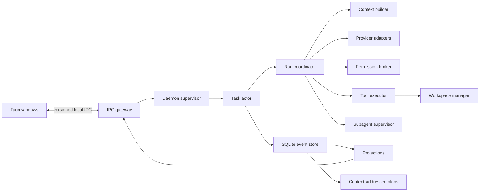

# Codex Capability Clone Design

**Status:** Approved on 2026-07-10.

## Goal

Replace Jyowo's current task, run, event, persistence, and conversation presentation model with a Codex-style local agent runtime and desktop experience.

The target includes:

- A durable, strictly ordered task timeline.
- A local daemon that outlives desktop windows.
- Resumable task segments after daemon or machine restart.
- Persistent queued user messages with edit, delete, and promotion controls.
- Safe-point steering and explicit force-stop steering.
- Permission review, context compaction, checkpoints, subagents, and background work.
- Mixed current-workspace and managed-worktree execution.
- Multi-window synchronization for one local user.
- A faithful Codex-style timeline and workspace layout in light, dark, and system themes.

This is a clean replacement. The product is still in development, so old sessions, events, and storage formats do not need compatibility or migration support.

## Non-goals

- Multi-user collaboration.
- Cross-device or cloud synchronization.
- A remote execution service.
- Automatic replay of commands or tools with unknown side effects.
- Preserving the current task protocol or conversation renderer.

## Selected Architecture

Jyowo will use an event-sourced local daemon with supervised task actors.

The daemon is the only writer of task truth. Desktop windows submit commands and consume committed events. Frontend state is a projection, not an independent task state machine.

## Runtime Topology

The daemon runs once per operating-system user.

- Opening Jyowo starts or attaches to the daemon.
- Closing every window does not stop active tasks or background processes.
- With no clients, active tasks, or background processes, the daemon exits after five idle minutes.
- A daemon crash causes the client to show a disconnected state and attempt a controlled restart.
- An OS restart restores durable state but never resumes execution automatically.
- Multiple windows attach to the same daemon and read the same projections.

The initial product remains local-only and single-user. This avoids distributed locks, account identity, remote synchronization, and merge semantics.

## Task Actor Model

Each task owns an actor, mailbox, queue, and current foreground run segment. The supervisor owns actor lifecycle, crash isolation, and concurrency quotas.

Task states are:

- `idle`
- `running`
- `waiting_permission`
- `yielding`
- `interrupted`
- `failed`
- `completed`

`completed` is re-openable: a new user message may create another run segment. Archival is a separate product state.

Only one foreground run segment may execute for a task. Subagents have their own actors and run segments, so they do not occupy the parent's foreground slot.

All state transitions happen through commands accepted by the task actor. A command carries a unique command ID, an idempotency key, and an expected stream version.

## Persistent Message Queue

Users may send messages while a run is active. These messages enter a durable queue owned by the task actor.

Queue item states are:

- `queued`: editable, deletable, and promotable.
- `promoting`: selected for steering; content and attachments are frozen.
- `consumed`: atomically bound to a new run segment.
- `deleted`: retained as a tombstone event but omitted from the normal conversation.

Editing uses `expectedRevision`. Concurrent edits from multiple windows cannot silently overwrite each other. A stale edit is rejected with the latest queue item revision.

Normal queued messages execute in order. Reordering is not part of the initial scope; promotion is the explicit mechanism for moving a message ahead.

### Safe-point promotion

Safe-point promotion is the default:

1. Accept `PromoteQueuedMessage`.
2. Change the queue item to `promoting`.
3. Change the current run to `yielding`.
4. Prevent the model loop from starting another tool call.
5. Allow the current atomic tool operation to finish.
6. Commit `run.safe_point_reached`.
7. Finish the old segment as `superseded`.
8. Start a new run segment and consume the promoted message atomically.

### Force-stop promotion

The user may choose "Stop now and run":

- Cancel the active model stream.
- Send termination to cancellable child processes.
- Do not attempt to roll back file, network, or external side effects that already occurred.
- Finish the current segment as `forced_interruption`.
- Start a new run segment with the promoted message.

Partial assistant output remains in the timeline and is marked incomplete.

Core queue and steering events include:

- `message.queued`
- `message.edited`
- `message.deleted`
- `message.promoted`
- `message.consumed`
- `run.yield_requested`
- `run.safe_point_reached`
- `run.interrupted`
- `run.started`

## Event Store

SQLite in WAL mode is the durable source of truth.

The storage model has four parts:

1. `event_log`: append-only events with global offset, aggregate stream, stream sequence, event type, schema version, timestamp, source, and payload.
2. `command_inbox`: accepted commands, idempotency keys, expected versions, and outcomes.
3. Projection tables: current task, run, queue, permission, subagent, workspace, and conversation-list views.
4. Blob metadata: references to content-addressed files for images, attachments, full command output, diffs, and checkpoints.

Actor event appends and synchronous projection updates occur in one SQLite transaction. Events are broadcast only after commit.

Clients consume events by global offset. Reconnecting clients load current projections and then request events after their last acknowledged offset. A projection can always be rebuilt from the event log.

Token streams are coalesced into bounded chunks rather than stored one token per event. Large output is written to the blob store; timeline events retain summaries and blob references.

Rust owns the protocol definitions. TypeScript types and runtime validators are generated from the Rust contract so the backend and renderer cannot drift independently.

## Execution Kernel

The daemon contains these runtime responsibilities:

- `Supervisor`: actors, crash isolation, quotas, and lifecycle.
- `TaskActor`: task state, queue, commands, and current run.
- `RunCoordinator`: model/tool/permission loop.
- `ContextBuilder`: model context, compaction, and checkpoints.
- `ProviderAdapter`: provider-neutral streaming across supported model providers.
- `PermissionBroker`: command, filesystem, network, MCP, and automation decisions.
- `ToolExecutor`: tool lifecycle and output capture.
- `WorkspaceManager`: worktrees, write leases, change summaries, and cleanup.
- `SubagentSupervisor`: parent-child agent topology and cancellation.

A run consumes one message, builds a context snapshot, starts a provider stream, executes authorized tools, records all committed results, and continues until it completes, yields, waits for permission, fails, or is interrupted.

## Workspace Isolation

Workspace mode is selected per task:

- `current`: execute in the selected current workspace.
- `managed_worktree`: execute in a daemon-managed Git worktree.

Current workspaces allow concurrent read-only tasks. Filesystem mutation requires an exclusive write lease for the affected workspace root. A conflicting writer waits or fails visibly; it never writes concurrently without an explicit user override.

Background tasks and parallel subagents default to managed worktrees. Users may explicitly share the current workspace when appropriate. Worktree creation, retention, and cleanup are durable events.

Non-Git workspaces support current-workspace mode. Managed isolation for non-Git directories is outside the initial scope.

## Permissions and Subagents

Permission decisions are produced only by the daemon PermissionBroker. UI clients may submit a decision but cannot synthesize a permission event.

While a run waits for permission, users may still add, edit, delete, or promote queued messages. Steering invalidates an unresolved request. The invalidation is recorded, and the next run evaluates permissions again.

Each subagent owns an actor, event stream, context, and workspace. The parent records references and summaries rather than copying the child's full event stream.

Stopping a parent requests child agents to finish at a safe point. The user may allow a child to continue as a background task. Permission requests from child agents are routed to the owning foreground task unless a saved policy can resolve them safely.

## Context Compaction and Checkpoints

Compaction changes only the model input. It never deletes canonical events or timeline history.

Each model context contains:

1. System rules, permission mode, and tool definitions.
2. The latest valid summary.
3. Complete events after the summary boundary.
4. Workspace state, unfinished plans, and subagent summaries.
5. The user message consumed by the current run.

A compaction artifact records its source event range, provider, model, token counts, schema version, and blob reference. Failed compaction leaves the previous valid summary untouched.

Safe checkpoints are created after:

- Message consumption.
- Completed tool calls.
- Permission decisions.
- Subagent state changes.
- Entry into waiting, yielding, interrupted, or completed states.

A checkpoint records event offset, context cursor, queue revision, workspace baseline, incomplete tools, and child-agent references. It does not serialize hidden model reasoning or a live provider connection.

Resuming always creates a new run segment. Completed tools reuse recorded results. Tools not yet started may be scheduled normally. A tool that has `started` but no terminal event becomes `indeterminate` and requires the user to choose whether to treat it as failed or execute it again.

## IPC and Security Boundary

The desktop and daemon communicate without opening a local HTTP or TCP port:

- Unix Domain Socket on macOS and Linux.
- Named Pipe on Windows.
- Length-prefixed, versioned messages.
- Multiplexed commands, responses, and event subscriptions.
- Blob access by controlled resource ID, never by arbitrary filesystem path supplied by the client.

The handshake contains protocol version, client version, daemon version, user-instance ID, ephemeral connection token, and last acknowledged event offset. Incompatible versions are rejected and require a controlled daemon restart or application upgrade.

All client commands are revalidated by the daemon. Workspace boundaries, permission payloads, blob identifiers, idempotency, and event sources are authoritative on the daemon side. Sensitive values are redacted before permission previews or events are persisted.

## Error and Recovery Rules

- Provider connection failures may retry only the model request.
- Tool failures are recorded and passed back to the model or user.
- Daemon crashes mark active segments `interrupted_by_restart`.
- OS restarts restore state but require explicit user continuation.
- Projection corruption triggers projection rebuild from the journal.
- Missing blobs remain represented by timeline events with a missing-artifact state.
- Expired permissions close the old request and are re-evaluated on continuation.
- `promoting` messages that were not consumed before a crash return to `queued`.
- Tools with unknown completion state are never replayed automatically.

## Desktop Experience

The visual target is the supplied Codex desktop reference.

### Conversation timeline

- User messages are right-aligned bubbles with attachments above and metadata below.
- Assistant output is an unboxed task timeline.
- Each run segment begins with status and elapsed time, followed by a divider.
- Narrative, tool activity, images, commands, diffs, compaction, subagents, and results stay in event order.
- Lightweight activities use rows, not cards.
- Commands, diffs, images, permissions, and other artifacts use richer containers.
- Completion, interruption, failure, and steering create explicit segment boundaries.

### Composer and queue

The composer remains active while a task runs. Sending while idle starts a run; sending while active adds a durable queue item.

The queue appears immediately above the composer, separate from completed history. Each item shows order, message summary, attachments, edit, delete, safe-point promotion, and a force-stop action in its overflow menu.

Editing happens inline so the main composer remains available. A promoted item shows a frozen "steering" state. When consumed, the item leaves the queue and becomes a user message at the correct run boundary.

Queue edit and delete audit events remain available in the inspector but do not clutter the main timeline.

### Workspace layout

The desktop layout contains:

- A fixed task header.
- A centered 760-840 px conversation column.
- A contextual right workspace for changes, terminal output, subagents, environment details, sources, attachments, and event audit.
- A bottom run status surface for active step and file-change summary.

The right workspace supports closed, 360-440 px inspector, and 45-50% collaboration modes. Narrow layouts close or overlay the inspector before shrinking the conversation column below a readable width.

### Themes and accessibility

Light, dark, and system modes use the same hierarchy, dimensions, and interaction rules. Components use semantic conversation, activity, artifact, diff, and status tokens rather than hard-coded dark colors.

Status is always conveyed by text and icon as well as color. Queue actions remain keyboard accessible and cannot exist only on hover. Status announcements use polite live regions. Destructive force-stop actions do not steal focus, and the timeline preserves scroll position while streaming or expanding artifacts.

## Verification Strategy

### Contract tests

- Generated Rust-to-TypeScript command and event contracts.
- Schema version handling.
- Invalid payload, source, permission, and blob-reference rejection.

### State-machine tests

- Model-based task, run, queue, permission, and subagent transitions.
- Randomized enqueue, edit, delete, promote, stop, reconnect, and resume sequences.
- Invariants for one foreground segment, stream versions, queue ordering, and single event application.

### Fault injection

Terminate the daemon around event append, projection update, blob write, tool start, permission wait, and checkpoint creation. Recovery must preserve event uniqueness, queue order, non-replay of completed tools, `indeterminate` outcomes, and projection rebuildability.

### Integration tests

- Real daemon with two clients.
- Concurrent queue edits.
- Safe-point and force-stop steering.
- Offset replay after disconnection.
- Parent and child cancellation.
- Current-workspace write leases.
- Managed-worktree lifecycle.
- Permission expiry and invalidation.

### Product acceptance

- Visual comparison against the supplied Codex references at fixed viewports.
- Light, dark, and system themes.
- Running, completed, interrupted, failed, permission, compaction, and steering states.
- Queue create, edit, delete, safe promotion, and force-stop promotion.
- Keyboard navigation, focus order, zoom, responsive reflow, and scroll anchoring.

Initial performance targets are 20 concurrent task actors, up to 8 concurrent subagents per task, incremental opening of a 100,000-event task, stable streaming UI, and timely task-list recovery after daemon restart.
