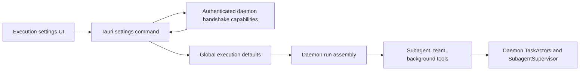

# Daemon-Native Agent Capabilities Design

## Goal

Make subagents, agent teams, and background agents fully usable through the current task daemon. Remove the legacy desktop capability resolver and keep the daemon as the only runtime authority.

## Current Failure

The desktop settings API still resolves agent availability through `AgentCapabilityResolutionContext`. That context described the deleted desktop conversation runtime and its `StreamPermissionRuntime`. The active settings commands now pass no context, so subagents are reported unavailable even though the daemon compiles and runs them.

The daemon currently enables only `AgentToolPolicy.subagents`. It explicitly disables `agent_team` and `background_agents`, although the SDK still contains both tools. Background execution already exists in the daemon as a detached child actor, but it is not exposed through the SDK `background_agent` capability. The SDK team runner also owns member execution internally instead of delegating each member to daemon-owned task actors.

The result is three conflicting sources of truth:

- desktop settings infer legacy runtime availability;
- SDK compile features describe available tool implementations;
- daemon run assembly decides which tools can actually execute.

## Chosen Architecture

The daemon is the only authority for agent capabilities and execution.

### Capability Contract

Add an `AgentCapabilities` value to the authenticated daemon handshake. It declares support for:

- subagents;
- agent teams;
- background agents.

These values describe executable daemon behavior, not saved user preferences. The desktop caches the authenticated handshake capabilities and projects them into execution settings responses. If the daemon is unavailable or its protocol is incompatible, all three capabilities fail closed with one daemon-unavailable reason.

Saved `subagentsEnabled`, `agentTeamsEnabled`, and `backgroundAgentsEnabled` values remain user preferences. Availability and enabled state stay separate.

The daemon validates the dependency invariant:

```text
agentTeamsEnabled -> subagentsEnabled
backgroundAgentsEnabled -> subagentsEnabled
```

The desktop validates the same invariant before persisting settings so invalid combinations never reach future runs. Disabling subagents atomically disables dependent capabilities in one settings write.

### Subagents

Keep the existing daemon `SubagentSupervisor`, durable child projections, workspace leases, permission routing, quotas, and recovery. The capability is available when the daemon binary is built with subagent support and its production supervisor has a runner factory.

No desktop `StreamPermissionRuntime`, agent runtime SQLite database, or legacy supervisor is reintroduced.

### Agent Teams

Refactor the SDK team tool boundary so it accepts a public `AgentTeamStarterCap`, parallel to `BackgroundAgentStarterCap`. The SDK tool remains responsible only for input validation, authorization planning, and stable output formatting.

The daemon implements the starter. A team creates a durable team projection and delegates every lead/member execution through the existing `SubagentSupervisor`. Each member therefore receives:

- its own TaskActor and event stream;
- its own workspace lease;
- daemon permission routing;
- daemon depth and global quotas;
- durable cancellation and recovery state.

Team coordination state is recorded in the task database. The parent records bounded member references and summaries, not copied member timelines. One active team per parent run remains enforced.

The initial profile selection uses the existing built-in `reviewer` lead and `worker` member. Missing or invalid profiles reject team start before any child actor is created.

### Background Agents

Implement the existing public `BackgroundAgentStarterCap` in the daemon. Starting a background agent creates a normal child through `SubagentSupervisor`, then durably detaches it before returning success.

The returned background-agent ID is the durable child task identity. Existing task projections provide status, title, timeline, pause/stop semantics, and restart recovery. There is no separate background registry, database, sidecar, or lifecycle state machine.

Parent safe-stop and force-stop ignore durably detached children. Daemon shutdown/restart recovers them through the same task and child projections used by other work.

### Run Assembly

`SdkRunFactory` derives one immutable `AgentToolPolicy` from execution defaults:

- enable `subagents` from `subagentsEnabled`;
- enable `agent_team` from `agentTeamsEnabled`;
- enable `background_agents` from `backgroundAgentsEnabled`;
- install the daemon team/background starter capabilities only when enabled;
- use existing bounded depth, subagent concurrency, and team-member limits.

Tool installation remains policy-gated inside the SDK. A disabled capability is absent from the model tool set, not exposed as a tool that fails later.

### Settings Flow



The desktop no longer opens an agent runtime store or checks SDK feature flags to answer settings requests.

## Error Handling

- Daemon unavailable: report a typed `daemonUnavailable` reason for every agent capability.
- Protocol mismatch: fail closed; do not infer support from the desktop build.
- Invalid settings dependency: reject the write with a typed invalid-payload error.
- Team startup failure: commit no team or child actor unless the full initial topology validates.
- Partial member failure after start: preserve the durable team and member states; return bounded summaries to the parent.
- Background detach failure: cancel the child and release its workspace unless the detach transition committed.
- Restart: recover committed actors and mark only genuinely interrupted in-flight execution according to existing daemon recovery rules.

## Legacy Cleanup

Remove:

- `AgentCapabilityResolutionContext`;
- `AgentCapabilityEnvironment` and compile-time desktop capability resolution;
- desktop agent runtime store probes used only for settings availability;
- `PermissionRuntimeUnavailable`, `BackgroundSupervisorUnavailable`, and other legacy-only unavailable reasons;
- duplicated project/no-workspace capability branches in Tauri;
- tests and fixtures that assert legacy runtime unavailability.

Keep reusable agent profiles, tool policy contracts, workspace isolation, SDK tools, and daemon subagent primitives.

Add an architecture policy test that rejects new Tauri references to legacy agent capability resolution or agent runtime storage.

## Verification

Tests must prove behavior at each boundary:

- contract round-trip and generated TypeScript schema for handshake capabilities;
- daemon handshake reports all three capabilities;
- settings reads and writes use daemon capabilities and enforce dependencies;
- run assembly exposes exactly the enabled tools;
- subagent tool creates a durable child actor;
- team tool creates durable lead/member actors and enforces quotas;
- background tool returns only after durable detachment;
- parent stop does not cancel detached background work;
- daemon restart recovers team and background projections;
- permission requests from every child route through the daemon broker;
- desktop component shows enabled and available state without stale warnings;
- architecture policy rejects legacy resolver/store reintroduction.

The final gate runs the affected Rust suites, desktop Vitest suite, daemon protocol generation check, architecture policies, formatting, lint, and type checking.
