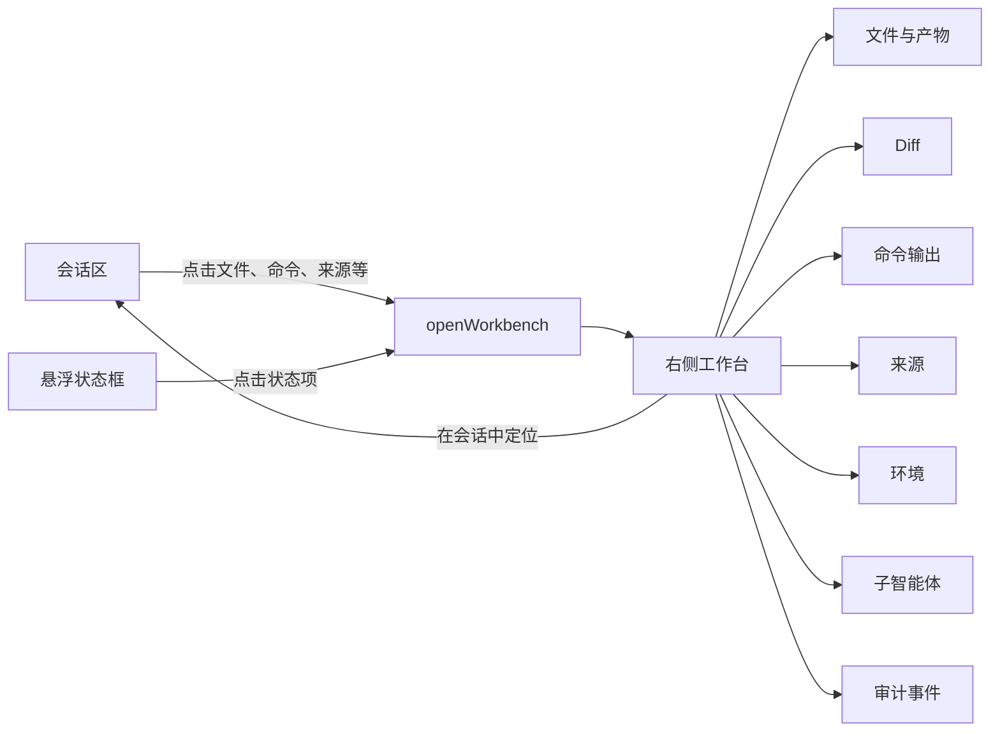
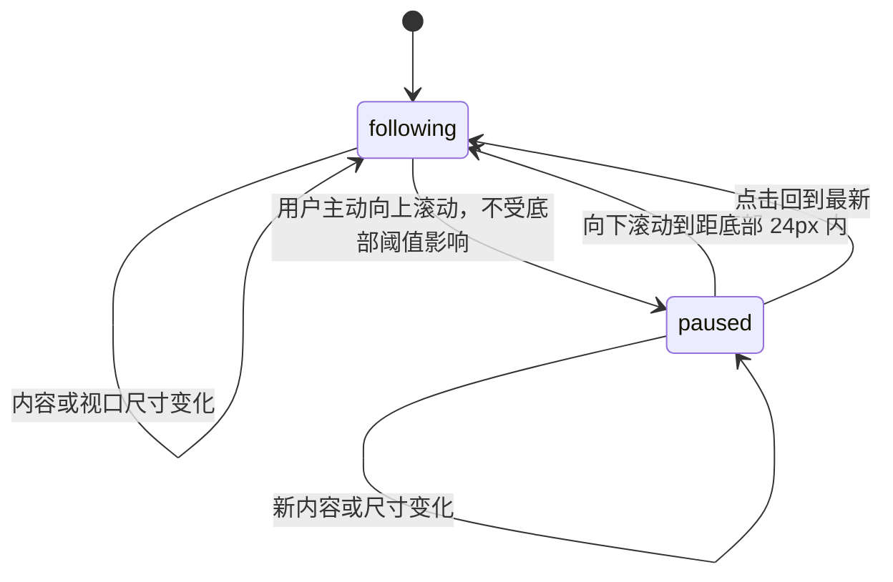

# 任务工作台上下文重构：设计与实施计划

## 文档状态

- 状态：Implemented and verified
- 日期：2026-07-14
- 范围：`apps/desktop` 任务会话、右侧工作台、运行状态摘要和时间线滚动
- 读者：产品、设计、桌面端前端、测试
- 实施结果：P0 与本次列入验收的 P1 已完成；系统打开、扩展性能验证和 P2 增强保留为后续工作

## 实施结果

本次重构已完成对象驱动工作台、悬浮任务上下文、预览与固定标签、会话双向定位、滚动状态机、响应式布局、偏好迁移、中英文和主要无障碍路径。500 条时间线虚拟化已有自动测试；大文件、大 Diff、200% 缩放和连续 ResizeObserver 压力验证仍属于扩展验证范围。

交付证据：

- 桌面停靠模式：`artifacts/design-qa/task-workbench-desktop-1440x900.png`
- 中屏覆盖模式：`artifacts/design-qa/task-workbench-overlay-900x900.png`
- 窄屏全屏模式：`artifacts/design-qa/task-workbench-fullscreen-690x844.png`
- 对象预览停靠模式：`artifacts/design-qa/task-workbench-object-preview-1440x900.png`
- 对象预览覆盖模式：`artifacts/design-qa/task-workbench-object-overlay-900x900.png`
- 对象预览全屏模式：`artifacts/design-qa/task-workbench-object-fullscreen-690x844.png`
- 浅色主题：`artifacts/design-qa/task-workbench-light-900x900.png`
- 全图视觉对照：`artifacts/design-qa/task-workbench-comparison-board.png`
- 局部视觉对照：`artifacts/design-qa/task-workbench-comparison-focus.png`
- 视觉与交互 QA：`design-qa.md`

验证结果：

- `pnpm check:frontend:fast`：69 个测试文件、710 项测试通过；
- `pnpm check:design-tokens`：通过；
- `pnpm check:daemon-protocol`：生成协议与 Rust 合约一致；
- `cargo test -p jyowo-harness-journal --features sqlite preserves_object_identity_for_generated_artifacts`：1 项通过；
- 浏览器控制台：无 `error` 或 `warn`；
- 浏览器交互：对象打开、标签替换与固定、来源定位、焦点恢复、悬浮框收起、三档响应式布局、浅色主题和滚动状态机均通过。

本节记录的是 2026-07-14 本地验证结果。截图可直接复核可见界面；命令结果是执行摘要，不等同于 CI 或签名制品。需要独立复现时，应在对应提交上重新执行上述命令和 Storybook 场景。

## 需求—实现—证据追踪

| 需求 | 实现位置 | 验证证据 |
|---|---|---|
| 统一具体对象 Target 协议 | `shared/state/workbench-selection.ts`、`workbench/task-workbench-target.ts`、`crates/jyowo-harness-contracts/src/daemon.rs` | Target、状态和协议测试；`check:daemon-protocol` 通过 |
| 正确识别 file、artifact、image | `task_projection.rs`、`task-live-projection.ts`、`TaskWorkbench.tsx` | Rust 对象身份测试；Projection 与工作台组件测试；对象预览截图 |
| 文本、图片和二进制按媒体类型预览 | `TaskWorkbench.tsx` | 真实 PNG 浏览器预览；文本 Blob、二进制元信息和 Object URL 生命周期组件测试 |
| 单一预览标签与固定标签 | `ui-store.ts`、`TaskWorkbench.tsx` | 标签替换、固定、去重、关闭活动标签后聚焦相邻标签测试与浏览器交互 |
| 具体 Target 过滤内容 | `SubagentsPanel.tsx`、`EnvironmentPanel.tsx`、`AuditPanel.tsx` | 各 Panel 测试；子智能体摘要使用 `resourceId="all"` 展示聚合列表，具体子智能体入口仍按 ID 过滤 |
| 动态悬浮摘要 | `TaskWorkbenchSummary.tsx`、`task-workbench-summary.ts` | 摘要模型和组件测试；桌面与对象预览截图 |
| 会话与工作台双向定位 | `TaskWorkspace.tsx`、`TaskTimeline.tsx`、`TimelineEvent.tsx` | 来源定位、高亮、关闭与 Esc 焦点恢复测试；浏览器验证焦点回到 `event-2` 的“打开文件”按钮 |
| Following / Paused 自动跟随 | `task-scroll-controller.ts`、`use-task-scroll-anchor.ts` | 24px/25px 边界、用户意图、流式更新测试；浏览器验证 Paused 时追加内容 `scrollTop` 不变，恢复后回到最新 |
| 阅读状态按任务隔离 | `TaskTimeline.tsx`、`ui-store.ts` | taskId 切换、滚动位置、未读数和可见锚点恢复测试 |
| Resize 和虚拟锚点保持位置 | `use-task-scroll-anchor.ts`、`TaskTimeline.tsx` | ResizeObserver、虚拟行卸载回退、500 条时间线和卸载清理测试 |
| 停靠、覆盖、全屏三档布局 | `global.css`、`TaskWorkspace.tsx` | 容器宽度 719/720/1039/1040 边界浏览器验证；三档截图；1040px 容器下面板宽度限制为 400px |
| 键盘、焦点、Esc 和全屏隔离 | `TaskWorkspace.tsx`、`TaskWorkbench.tsx` | overlay Esc、失效 opener、相邻标签焦点、fullscreen `inert`/`aria-hidden` 与“返回会话”焦点测试 |
| 中英文与 ARIA | `locales/zh-CN.ts`、`locales/en-US.ts`、工作台组件 | i18n 测试、可访问名称断言和浏览器可访问树检查 |
| 加载、为空、失效和重试 | `TaskWorkbench.tsx`、`AuditPanel.tsx` | Blob 缺失、非文本媒体、加载失败和 Audit 重试组件测试 |
| 完整回归 | `apps/desktop` 测试与 Storybook 场景 | 69 个测试文件、710 项测试；设计变量、协议、Rust 测试和浏览器控制台全部通过 |

## 输入与参考

| 参考图 | 主要内容 | 本方案吸收的设计点 |
|---|---|---|
| `3b7ef449-4079-4219-9704-e14722513907.png` | 环境信息、变更、分支、来源组成的悬浮卡片 | 只展示有内容的摘要项；数量与状态同行；分组之间使用弱分隔 |
| `451bc809-6418-4f4d-bf39-95b24c0d2ffe.png` | 环境信息与子智能体摘要 | 把子智能体作为任务上下文的一部分，而不是独立入口 |
| `b34dc124-563a-48f9-a6d2-d57e15172348.png` | 分支活动态与精简来源区 | 当前对象整行高亮；允许摘要随任务内容动态增减 |
| `93f8a17f-c12d-4c54-9a30-acd041ba7b5c.png` | 会话与右侧文件工作区并列 | 会话保留过程，右侧承载长内容；两侧围绕同一对象联动 |
| `0e3ac6f3-7ac4-4b89-a575-2f498195669f.png` | 会话与右侧子智能体列表并列 | 工作台按对象类型切换内容；运行中和已完成状态分组展示 |

参考图的共同结构不是“右侧增加一个固定菜单”，而是把任务上下文拆成两层：悬浮卡片负责扫描状态，工作台负责检查对象。用户无需离开会话，也不必在多个页面之间切换。

本方案保留这种分层，但不复刻完整代码编辑器。右侧继续复用 Jyowo 已有的 Diff、命令、来源、环境、子智能体和审计面板。文件树、编辑器、保存和冲突处理不进入本次范围。

## 参考设计分析

### 信息层级

参考图使用三层信息密度：

1. 会话是主内容，保持最大的视觉面积。
2. 悬浮卡片提供任务级概览，宽度窄、背景轻、操作密度低。
3. 右侧工作台按需出现，展示一个具体对象的完整内容。

三层之间通过“摘要项—对象—来源消息”形成可逆路径。用户既可以从会话打开对象，也可以从对象返回会话来源。

### 悬浮卡片

- 卡片靠近会话右上区域，不占用常驻导航宽度；
- 分组标题使用次级文字，主要操作集中在行级入口；
- 图标表达对象类型，文字表达名称，尾部表达数量、状态或跳转能力；
- 活动态使用整行背景，不依赖文字颜色；
- 空分组不占位，避免卡片变成固定功能清单；
- 圆角、弱边框和半透明背景降低对会话正文的竞争。

### 右侧工作台

- 工作台只在用户检查对象时出现；
- 顶部保留对象标签，支持在少量上下文之间切换；
- 内容区使用对象最适合的展示器，不强制统一成一种布局；
- 会话和工作台同时可见时，用户可以边阅读执行过程边核对结果；
- 空间不足时，工作台从并排切换为覆盖或全屏，功能不删减。

### 可改进点

参考图没有完整表达以下行为，本方案需要补齐：

- 点击多个对象后的标签替换与保留规则；
- 工作台关闭后的焦点恢复；
- 对象如何定位回会话来源；
- 用户阅读历史消息时的自动滚动边界；
- 中窄屏布局；
- 加载失败、资源失效和权限不足；
- 键盘操作、屏幕阅读器语义和减少动态效果。

## 目标

将当前六个固定分类组成的任务工作台，重构为围绕会话对象展开的上下文工作台。

页面由三层组成：

1. 会话区展示消息、执行过程和结果。
2. 悬浮状态框汇总当前任务的环境、变更、命令、来源、子智能体和产物。
3. 右侧工作台展示用户当前选择的具体对象。

用户从会话或悬浮状态框打开对象，在右侧查看详情，并可返回对象在会话中的来源位置。会话位于最新内容时自动跟随；用户主动向上阅读后立即停止跟随。

## 核心决策

1. 工作台从固定分类导航改为具体对象导航。
2. 普通点击复用一个预览标签，固定标签用于保留对照对象。
3. 会话入口和悬浮状态框使用同一套 Target 协议。
4. 标签、活动对象和打开状态按任务隔离；面板宽度作为全局用户偏好保存。
5. 会话滚动使用 `following / paused` 两态模型，用户上滚优先级高于后台更新。

## 非目标

- 不在本次实现完整代码编辑器、文件树或多文件编辑能力；
- 不替换现有 Diff、命令、来源、环境、子智能体和审计内容面板；
- 不将悬浮状态框设计为第二套导航或独立业务状态源；
- 不持久化具体标签、活动对象和工作台打开状态；
- 不重构任务工作台之外的通用 `WorkbenchSelection`。
- 不在本次增加不支持媒体的系统打开入口。

## 重构前问题

### 工作台以分类为中心

当前工作台固定展示以下六个 Tab：

- `changes`
- `commands`
- `agents`
- `environment`
- `sources`
- `audit`

用户点击会话项目后，系统只选择一个分类。工作台无法表达“正在查看哪个具体文件、命令或来源”，也无法保留多个需要对照的对象。

### 工作台状态不属于任务

当前 `TaskWorkbenchSelection` 是单一全局选择。切换任务时选择被清空，返回任务后无法恢复查看状态。打开状态与宽度模式也混合在 `closed / inspector / collaboration` 中。

### 会话与工作台缺少回链

会话可以打开工作台，但工作台不能稳定定位回来源消息。对象身份、来源事件和焦点来源没有形成完整链路。

### 自动跟随依赖事件字段变化

当前滚动逻辑只监听最新事件身份和流式文本长度。以下变化可能不会触发正确跟随：

- 图片加载完成；
- 代码块展开；
- 附件完成解析；
- Composer 高度变化；
- 工作台开关导致文本重新换行；
- 虚拟列表重新测量行高。

当前 96px 底部阈值也会导致用户小幅向上滚动后仍被识别为跟随状态。

## 设计原则

### 会话负责过程

消息和执行事件按时间出现。会话不承担长内容检查、文件对照和完整输出浏览。

### 悬浮框负责状态

悬浮框只展示当前任务中有实际内容的状态，不复制完整工作台，也不形成第二套导航。

### 工作台负责对象

工作台的首层身份是具体对象，而不是分类。分类只决定内容如何渲染。

### 用户阅读优先

系统只有在用户保持最新内容阅读状态时自动跟随。用户主动向上滚动后，所有后台更新都必须保持当前阅读位置。

### 状态按任务隔离

标签、当前对象、打开状态和阅读状态不能跨任务串联。面板宽度属于用户布局偏好，在任务之间共享。

### 复用现有视觉体系

继续使用当前设计变量、间距、字体、状态色、Lucide 图标和已有内容面板，不引入另一套组件风格。

## 信息架构



## 页面结构

### 会话区

会话仍是任务页面主体。以下内容可以打开工作台：

- 文件和附件；
- 代码路径和行号；
- 文件变更摘要；
- 命令卡片；
- 来源引用；
- Workspace 环境事件；
- 子智能体状态；
- 生成产物；
- 权限、错误、压缩和其他审计事件。

工作台打开和关闭不能清空输入框或破坏用户当前阅读位置。焦点遵循操作来源：指针或键盘激活入口后保留在该入口；全屏打开时移到“返回会话”；关闭时返回最近一次有效入口，入口失效时回到会话区。

### 悬浮状态框

悬浮状态框位于会话区域右侧，不占用固定栏位。它从任务 Projection、Timeline 和 Events 派生以下摘要：

- 环境；
- 文件变更；
- 命令；
- 来源；
- 子智能体；
- 产物。

没有内容的项目不显示。每项包含图标、名称、数量或状态，整行可点击。

示例：

- `5 个文件 · +126 −34`
- `2 个子智能体运行中`
- `1 个命令执行中`
- `4 个来源`
- `当前分支 main`

悬浮框支持：

- 当前活动对象高亮；
- 运行中、完成、失败、需要处理状态；
- 收起为紧凑状态；
- 新事件提示；
- 内容过多时内部滚动；
- 自动避开输入框和“回到最新”按钮。

悬浮框不保存独立业务数据。它只保存展开或收起这类纯界面状态。

### 右侧工作台

工作台由三部分组成：

1. 标题区：对象类型、名称、所属任务、定位和关闭操作。
2. 标签区：一个临时预览标签和若干用户固定标签。
3. 内容区：复用现有 Panel 展示对象详情。

原六个分类不再作为常驻一级 Tab。`DiffPanel`、`CommandPanel`、`SourcesPanel`、`EnvironmentPanel`、`SubagentsPanel` 和 `AuditPanel` 继续作为内容渲染器使用。

## 工作台对象模型

```ts
type TaskWorkbenchTarget = {
  taskId: string
  kind:
    | 'file'
    | 'diff'
    | 'command'
    | 'source'
    | 'environment'
    | 'subagent'
    | 'artifact'
    | 'audit'
  resourceId: string
  title: string
  sourceEventId?: string
  blobId?: string
  line?: number
}
```

标签身份是 `kind + resourceId`。同一类型、同一 `resourceId` 复用原标签；不同类型即使共享一个 Blob 或事件 ID，也作为不同对象打开。`resourceId` 优先使用 Blob ID、事件 ID、子智能体 ID 或其他稳定协议标识。不得使用标签标题作为唯一身份。

### 时间线映射

| 时间线内容 | 目标类型 | 主要身份 |
|---|---|---|
| 文件、附件 | `file` | 文件路径或 Blob ID |
| `diff` | `diff` | Blob ID 或事件 ID |
| `command` | `command` | 命令事件 ID |
| `image`、引用 | `source` | Blob ID 或来源 ID；`source` 表示来源对象，内容仍按 Blob `mediaType` 使用图片预览器 |
| Workspace Notice | `environment` | 环境事件 ID |
| `subagent` | `subagent` | 子任务或代理 ID |
| 生成结果 | `artifact` | Artifact ID 或 Blob ID |
| 权限、错误、压缩、工具活动 | `audit` | 事件 ID |

映射集中在一个纯函数中，不在各个展示组件中重复判断。

## 工作台状态模型

```ts
type WorkbenchTab = {
  id: string
  target: TaskWorkbenchTarget
  pinned: boolean
}

type TaskWorkbenchSession = {
  open: boolean
  activeTabId: string | null
  previewTabId: string | null
  tabs: WorkbenchTab[]
}

type TaskWorkbenchState = Record<string, TaskWorkbenchSession>

type TaskWorkbenchPreferences = {
  width: number
}
```

Record 的键是任务 ID。`TaskWorkbenchPreferences` 独立于任务 Session，由界面偏好存储负责持久化。

### 交互状态表

| 用户操作或系统事件 | 工作台状态 | 标签状态 | 会话滚动 | 焦点结果 |
|---|---|---|---|---|
| 在会话中单击对象 | 打开 | 创建或替换预览标签 | 保持原状态 | 保留触发入口焦点；全屏时移到“返回会话” |
| 在悬浮框单击摘要项 | 打开 | 激活已有对象或替换预览标签 | 保持原状态 | 记录摘要项为关闭后的返回点 |
| 双击标签或执行固定 | 保持打开 | 预览标签转为固定标签 | 不变 | 保持当前标签 |
| 打开已经存在的对象 | 保持打开 | 只激活，不重复创建 | 不变 | 保持触发方式对应的焦点策略 |
| 关闭活动标签 | 有其他标签时保持打开 | 激活相邻标签 | 不变 | 移到新活动标签 |
| 关闭最后一个标签 | 关闭 | 清空当前对象 | 不变 | 返回最近一次有效触发元素 |
| 关闭工作台 | 关闭但保留任务 Session | 标签不删除 | 保持阅读位置 | 返回触发元素；元素失效时返回会话区 |
| 点击“在会话中定位” | 保持打开 | 不变 | 程序定位完成后显式进入 Paused | 目标消息可聚焦并短暂高亮 |
| 新内容到达且处于 Following | 不变 | 不变 | 合并到下一帧并跟随底部 | 不抢焦点 |
| 用户向上滚动 | 不变 | 不变 | 立即进入 Paused | 不变 |
| Paused 时新内容到达 | 不变 | 不变 | 保持可见锚点，累计提示 | 不变 |
| 点击“回到最新” | 不变 | 不变 | 滚到底部并恢复 Following | 保持当前操作上下文 |
| 切换任务 | 读取目标任务 Session | 隔离显示 | 使用目标任务阅读状态 | 不复用其他任务触发元素 |

### 打开对象

所有入口统一调用：

```ts
openWorkbench(target)
```

行为按以下顺序执行：

1. 如果同一对象已经打开，激活原标签。
2. 如果存在未固定的预览标签，用新对象替换它。
3. 如果没有预览标签，创建新的预览标签。
4. 打开工作台并激活目标标签。
5. 固定标签不得被自动替换。

### 关闭对象和工作台

- 关闭工作台只隐藏面板，不删除任务标签。
- 关闭标签删除对应对象。
- 关闭活动标签后，优先激活原位置右侧标签；没有右侧标签时激活左侧标签。
- 最后一个标签关闭后，工作台进入关闭状态。
- 关闭工作台后，焦点返回触发打开操作的元素。

### 任务切换

- 切换任务时读取目标任务自己的 Session。
- 不显示其他任务的标签。
- 返回任务后恢复标签和活动对象。
- 工作台宽度在任务之间共享。
- 打开状态不跨应用重启恢复。
- 面板宽度作为用户偏好持久化。

现有通用 `WorkbenchSelection` 与任务工作台属于不同功能，本次不合并。

## 标签交互

### 预览标签

- 普通点击对象产生预览标签。
- 再打开其他对象时替换。
- 使用较弱的视觉状态表示临时标签。

### 固定标签

P1 支持通过标签固定按钮或双击固定。

固定后：

- 不再被预览对象替换；
- 可以单独关闭；
- 在当前应用会话中随任务状态保留。

### 标签溢出

P1 使用横向滚动。P2 再增加溢出菜单、最近查看、关闭其他标签和拖动排序。

## 会话与工作台双向联动

### 从会话打开工作台

1. 用户激活会话对象。
2. 将时间线项目转换成 `TaskWorkbenchTarget`。
3. 保存触发元素引用。
4. 调用 `openWorkbench(target)`。
5. 工作台激活对应标签。

### 从悬浮框打开工作台

1. 从 Projection、Timeline 和 Events 派生摘要项。
2. 文件、变更、命令、来源、环境和审计摘要指向当前最新的具体对象。
3. 子智能体摘要使用 `resourceId="all"` 打开聚合列表；列表中的具体子智能体仍使用自己的 ID。
4. 点击后调用相同的 `openWorkbench(target)`。
5. 悬浮框根据活动 Target 显示当前态。

### 在会话中定位

工作台提供“在会话中定位”：

1. 根据 `sourceEventId` 请求时间线定位。
2. 时间线滚动到目标消息。
3. 目标消息短暂高亮。
4. 工作台保持当前标签。
5. 键盘操作时允许焦点进入目标消息。

定位请求由 `TaskWorkspaceView` 在工作台和时间线之间协调，不进入持久化状态。

## 会话滚动设计

用户可感知状态只有 `following` 和 `paused`。



### Following

用户位于最新内容区域。以下变化发生后保持底部：

- 新消息；
- 流式文本增长；
- 图片加载完成；
- 代码块展开；
- 附件解析；
- Composer 高度变化；
- 工作台打开、关闭或改变宽度；
- 窗口尺寸变化；
- 虚拟列表重新测量。

### Paused

用户通过滚轮、触控板、滚动条、触屏或键盘主动向上滚动后立即进入暂停状态。即使仍在距底部 24px 范围内，向上动作也优先进入 Paused。只有后续向下滚回阈值内，或点击“回到最新”，才恢复 Following。

暂停后：

- 新内容不能把窗口拉回底部；
- 当前可见消息及其屏幕偏移保持稳定；
- 显示“回到最新”；
- 新顶层消息增加未读数量；
- 同一条流式消息持续增长只显示“有新内容”，不按 token 计数。

用户向下滚动到距底部 24px 范围内，或点击“回到最新”后恢复 Following。

### 程序滚动与用户滚动

滚动控制器必须记录程序滚动保护标记。由以下操作产生的 `scroll` 事件不得切换成 Paused：

- 初次进入任务滚到底部；
- 点击“回到最新”；
- Following 状态下内容尺寸变化；
- 历史消息前插补偿；
- “在会话中定位”的内部滚动事件。

“在会话中定位”完成后会显式进入 Paused。这不是由 `scroll` 事件推断出的用户滚动，而是定位动作的结果，确保用户检查历史对象时不会被下一次内容更新拉回底部。

### 尺寸监听

使用 `ResizeObserver` 监听时间线内容容器和视口。

- Following：在下一动画帧滚到底部。
- Paused：可见区域下方的普通内容增长不修改 `scrollTop`；可见区域上方发生高度变化时，允许调整 `scrollTop` 以恢复可见锚点和屏幕偏移。
- 历史消息前插：使用现有高度差补偿。
- 工作台导致重新换行：记录可见消息和顶部偏移，布局完成后恢复。
- 多次更新通过 `requestAnimationFrame` 合并。

## 运行状态栏

现有 `RunStatusBar` 与悬浮框存在信息重复。调整后：

- 保留当前运行步骤；
- 保留耗时；
- 保留等待权限等需要立即处理的状态；
- 队列、变更、来源和子智能体数量移动到悬浮框；
- 任务没有运行时继续隐藏。

## 响应式布局

继续使用任务容器的 Container Query。

### 停靠模式

条件：任务区域宽度 `>= 1040px`。

- 会话最小宽度 640px；
- 工作台默认宽度 400px；
- 保存宽度范围 360–640px；
- 实际宽度为 `clamp(360px, 保存宽度, min(640px, 容器宽度 - 640px))`；左边框计入工作台盒模型，不另占分隔宽度；
- 会话和工作台同时可操作；
- 不限制焦点范围。

### 覆盖模式

条件：任务区域宽度为 `720–1039px`。

- 工作台覆盖在会话右侧；
- 宽度不超过 480px；
- 覆盖模式只限制显示宽度，不改写已保存宽度；返回停靠模式后恢复原偏好；
- 不继续压缩会话；
- `Esc` 关闭；
- 关闭后恢复触发元素焦点。

### 全屏模式

条件：任务区域宽度 `< 720px`。

- 工作台占满任务区域；
- 显示明确返回按钮；
- 焦点限制在工作台内；
- 关闭后恢复原触发位置。

工作台宽度通过 `--task-workbench-width` CSS 变量传入布局。

## 视觉规范

### 工作台

- 使用现有 `bg-background`、`bg-surface`、`border-border` 和文字变量；
- 标题栏高度保持 44px；
- 活动标签同时使用文字和底边表达；
- 标题和辅助信息单行截断；
- 内容区独立滚动；
- 停靠模式不使用大面积阴影；
- 覆盖模式使用轻量阴影区分层级。

### 悬浮状态框

- 使用现有圆角卡片风格；
- 使用轻量边框和半透明背景；
- 每行保持一致高度；
- 使用现有 Lucide 图标；
- 状态不能只通过颜色表达；
- 焦点态必须可见。

## 键盘、焦点与无障碍

- 悬浮框项目均可通过键盘打开；
- 标签使用 `tablist / tab / tabpanel` 语义；
- 左右方向键切换标签；
- `Home` 和 `End` 定位首尾标签；
- `Enter` 激活；
- 关闭和固定按钮有完整可读名称；
- 工作台使用标题关联 `aria-label` 或 `aria-labelledby`；
- 新内容提示使用 `aria-live="polite"`；
- 不为每个流式 token 触发朗读；
- 新消息不得抢走输入框焦点；
- 开启减少动态效果时使用即时滚动。

## 异常状态

| 状态 | 处理方式 |
|---|---|
| 加载中 | 显示与最终结构接近的骨架 |
| 无内容 | 说明当前没有可展示内容 |
| Blob 丢失 | 显示资源不可用，不展示空白面板 |
| 权限不足 | 显示原因和重试入口 |
| 不支持预览 | 本次显示 MIME 和字节数；系统打开入口保留为后续项 |
| 命令失败 | 保留输出、退出码和错误信息 |
| 子智能体失败 | 显示失败阶段和已有结果 |
| 来源失效 | 保留来源名称和地址 |
| 内容更新 | 局部刷新，不重置标签和滚动 |
| 大文件或大 Diff | P2 使用增量加载或虚拟列表 |

## 实施计划

### 阶段一：工作台状态模型与对象协议，P0

**文件**

- 修改 `apps/desktop/src/shared/state/workbench-selection.ts`
- 修改 `apps/desktop/src/shared/state/ui-store.ts`
- 新增对应状态单元测试

**任务**

1. 定义 `TaskWorkbenchTarget`、`WorkbenchTab` 和 `TaskWorkbenchSession`。
2. 将单一 `taskWorkbenchSelection` 改为按任务保存的状态。
3. 实现 `openWorkbench`、`closeWorkbench`、`activateTab` 和 `closeTab`。
4. 实现对象去重和预览标签替换。
5. 保留现有通用 `WorkbenchSelection`，不扩大重构范围。

**验收**

- 状态转换不依赖 React 组件；
- 同一对象不会生成重复标签；
- 固定标签不会被预览替换；
- 任务之间不共享标签。

### 阶段二：会话对象入口与回链，P0/P1

**文件**

- 修改 `apps/desktop/src/features/tasks/TaskWorkspace.tsx`
- 修改 `apps/desktop/src/features/tasks/timeline/TimelineEvent.tsx`
- 修改 `apps/desktop/src/features/tasks/timeline/TaskTimeline.tsx`
- 修改 `apps/desktop/src/features/tasks/TaskWorkspace.test.tsx`

**任务**

1. 将 `workbenchPanel(item)` 替换为纯函数 `workbenchTarget(item)`。
2. 让所有时间线入口调用统一打开方法。
3. 保存打开工作台的触发元素。
4. P1 增加工作台到会话的定位请求。
5. P1 为目标时间线项目增加短暂高亮。

**验收**

- Diff、命令、来源、环境、子智能体和审计事件均能打开正确对象；
- P1 “在会话中定位”可以回到来源消息；
- 关闭工作台后焦点返回原入口。

### 阶段三：工作台外壳与对象标签，P0/P1

**文件**

- 修改 `apps/desktop/src/features/tasks/workbench/TaskWorkbench.tsx`
- 修改 `apps/desktop/src/features/tasks/workbench/TaskWorkbench.test.tsx`
- 复用现有六个内容 Panel

**任务**

1. 删除六个固定一级 Tab。
2. 增加对象标题区和单一预览标签。
3. 按 Target Kind 渲染现有 Panel。
4. 增加加载、空内容和失效状态。
5. P1 增加固定标签、关闭标签和横向溢出。

**验收**

- 原有面板能力不回退；
- 重复打开对象只激活原标签；
- 对象实时更新不重置活动标签和内容滚动位置。

### 阶段四：悬浮状态框与运行状态栏，P0/P1

**文件**

- 新增 `apps/desktop/src/features/tasks/workbench/TaskWorkbenchSummary.tsx`
- 新增 `apps/desktop/src/features/tasks/workbench/task-workbench-summary.ts`
- 修改 `apps/desktop/src/features/tasks/TaskWorkspace.tsx`
- 修改 `apps/desktop/src/features/tasks/RunStatusBar.tsx`
- 新增摘要模型和组件测试

**任务**

1. 从任务状态派生摘要项目。
2. 只生成有实际内容的项目。
3. 为每个摘要项目生成工作台 Target。
4. 增加活动态、运行态、失败态和需要处理状态。
5. 从底部状态栏移除重复数量。
6. P1 增加收起状态和新事件提示。

**验收**

- 悬浮框与会话对象使用同一打开协议；
- 悬浮框没有重复业务状态；
- 不遮挡输入框和“回到最新”。

### 阶段五：滚动状态机，P0/P1

**文件**

- 修改 `apps/desktop/src/features/tasks/timeline/task-scroll-controller.ts`
- 修改 `apps/desktop/src/features/tasks/timeline/use-task-scroll-anchor.ts`
- 修改 `apps/desktop/src/features/tasks/timeline/TaskTimeline.tsx`
- 修改 `apps/desktop/src/features/tasks/timeline/TaskTimeline.test.tsx`

**任务**

1. 将 `followLatest` 布尔值升级为 `following / paused`。
2. 区分用户滚动和程序滚动。
3. 将恢复底部阈值从 96px 调整为 24px。
4. 使用 `ResizeObserver` 监听内容和视口尺寸。
5. P1 增加未读消息数量；P0 保留流式新内容提示。
6. 保留历史消息前插高度补偿。
7. 处理虚拟列表重新测量。
8. 处理工作台开关和宽度变化导致的重新换行。

**验收**

- 位于底部时，所有内容尺寸变化都保持最新内容可见；
- 用户向上滚动后立即停止跟随；
- 图片加载和工作台开关不会移动暂停状态下的阅读位置；
- 点击“回到最新”恢复 Following。

### 阶段六：响应式布局、偏好和无障碍，P0/P1

**文件**

- 修改 `apps/desktop/src/shared/styles/global.css`
- 修改 `apps/desktop/src/shared/local-store/ui-preferences-store.ts`
- 修改 `apps/desktop/src/app/providers.tsx`
- 修改中英文翻译资源和相关测试

**任务**

1. 实现停靠、覆盖和全屏布局。
2. P1 增加面板宽度拖动。
3. 持久化面板宽度。
4. 将旧 `inspector / collaboration` 偏好迁移为数值宽度。
5. 停止持久化工作台打开状态。
6. 完成键盘、焦点和屏幕阅读器语义。

**验收**

- 三种布局都能完成对象打开、切换、定位和关闭；
- 键盘可以完成主要流程；
- 打开工作台不清空 Composer；关闭后焦点返回有效入口，入口失效时回到会话区；
- 中英文界面没有新增硬编码文案。

### 阶段七：性能与完整验证，P1/P2

当前状态：500 条时间线虚拟化、快速流式更新、Observer 与动画帧卸载清理已有自动测试或代码路径验证。大文件、大 Diff、连续 ResizeObserver 压力、200% 缩放和完整减少动态效果浏览器验证仍待执行，不计入本次 P1 验收范围。

**任务**

1. 验证 500 条以上时间线的虚拟列表。
2. 验证大文件和大 Diff。
3. 验证快速流式更新和连续 ResizeObserver 回调。
4. 检查组件卸载后的 Observer、动画帧和事件监听清理。
5. P2 增加大内容增量加载和标签溢出增强。

## 测试计划

### 状态单元测试

- 首次打开创建预览标签；
- 新对象替换未固定预览；
- 固定标签不被替换；
- 重复对象只激活；
- 关闭活动标签选择相邻标签；
- 切换任务恢复各自状态。

### 组件测试

- 会话对象映射到正确 Target；
- 工作台按 Target Kind 展示正确 Panel；
- Blob 丢失显示异常状态；
- 悬浮框只显示有内容的摘要；
- 工作台可以定位回来源消息；
- 标签键盘操作符合预期。

### 滚动测试

- 初次进入定位到底部；
- 流式文本增长时 Following；
- 用户上滚后进入 Paused；
- Paused 状态下图片加载不移动位置；
- 工作台开关不破坏阅读锚点；
- 历史消息前插保持位置；
- 点击“回到最新”恢复 Following；
- 程序滚动不会被误判成用户滚动。

### 响应式与视觉检查

- `>= 1040px` 停靠；
- `720–1039px` 覆盖；
- `< 720px` 全屏；
- 浅色和深色主题；
- 中文和英文；
- 200% 缩放；
- 减少动态效果；
- 键盘无鼠标流程。

### 建议命令

```bash
pnpm -C apps/desktop test src/features/tasks/workbench/TaskWorkbench.test.tsx
pnpm -C apps/desktop test src/features/tasks/timeline/TaskTimeline.test.tsx
pnpm -C apps/desktop test src/features/tasks/TaskWorkspace.test.tsx
pnpm check:frontend:fast
pnpm check:design-tokens
```

## 发布优先级

### P0

- 统一 Target 和打开协议；
- 单一预览标签；
- 按任务隔离；
- 会话对象打开工作台；
- 悬浮状态框核心摘要；
- Following 和 Paused 状态机；
- ResizeObserver 尺寸跟随；
- 工作台开关时保持阅读锚点；
- 停靠、覆盖和全屏布局；
- 基础加载、为空和失效状态。

### P1

状态：下列本次验收项已完成；系统打开不在本次验收范围，大内容、200% 缩放和连续 ResizeObserver 等扩展验证见阶段七。

- 固定标签；
- 在会话中定位；
- 未读消息数量；
- 任务阅读状态恢复；
- 面板宽度调整；
- 悬浮框收起；
- 完整键盘和焦点管理；
- Audit 加载失败重试和不支持媒体的元信息展示。

### P2

- 大文件和大 Diff 增量加载；
- 标签溢出菜单；
- 最近查看对象；
- 标签排序；
- 更完整的摘要筛选。
- 不支持媒体的系统打开入口。

## 风险与控制

### 虚拟列表锚点失效

时间线项目可能在布局更新后被虚拟化卸载。锚点恢复优先使用稳定 Block Key 和虚拟列表偏移，不能只保存 DOM 节点。

### ResizeObserver 循环

Observer 回调不能同步反复写入布局。滚动写操作统一合并到下一动画帧，并在卸载时取消。

### 程序滚动误判

所有内部滚动入口使用统一控制器设置保护标记。组件不能自行调用 `scrollIntoView` 绕过控制器。

### 偏好迁移

旧的 `closed / inspector / collaboration` 仍可能存在于本地 Store。读取时需要兼容并转换，写入时只保存新宽度字段。

### 双工作台状态混淆

代码中同时存在通用 `WorkbenchSelection` 和任务工作台状态。本次只修改 `TaskWorkbench` 路径，避免扩大到其他会话表面。

## 不采用的方案

### 保留六个固定 Tab，再增加对象标签

这会形成分类导航和对象导航两套首层结构，用户仍然无法判断点击会话对象后工作台为何切换到某个分类。

### 每次点击都创建永久标签

浏览几个文件后会迅速产生大量标签。单一预览标签可以支持快速浏览，固定操作用于保留少量需要对照的对象。

### 只监听最新消息 ID

图片加载、重新换行和 Composer 高度变化不会产生新的消息 ID，无法解决实际的自动跟随问题。

### 用户离开底部后继续按阈值跟随

这会覆盖用户主动阅读历史内容的意图。向上滚动必须立即进入 Paused，靠近底部只用于恢复 Following。

### 将工作台打开状态永久保存

应用重启后具体对象可能已经失效。只持久化宽度，标签和打开状态保留在当前应用会话内。

## 发布验收标准

P0 发布必须同时满足：

1. 所有会话对象通过统一 Target 打开。
2. 工作台不再使用六个固定一级 Tab。
3. 同一对象不产生重复标签。
4. 工作台状态不跨任务串联。
5. 位于底部时，流式文本和真实尺寸变化都会自动跟随。
6. 用户向上滚动后，任何后台更新都不能拉回底部。
7. 工作台开关、图片加载和历史消息前插不破坏阅读位置。
8. 停靠、覆盖和全屏模式均可完成主要流程。
9. 鼠标和键盘均可完成对象打开、切换和关闭。
10. 原有 Diff、命令、来源、环境、子智能体和 Audit 能力没有回退。
