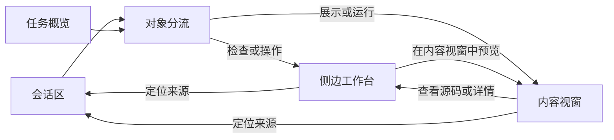

# 任务内容视窗与三层工作区设计

## 文档状态

- 状态：已按三层工作区模型重写
- 日期：2026-07-22
- 范围：桌面端任务会话、任务概览、侧边工作台和内容视窗
- 替代决策：不再将任务工作台升级为浮动运行视窗；新建独立的内容视窗

## 背景

当前任务页已经有两个右侧层级：

1. 任务概览展示工作区、变更、命令、来源、子智能体和产物等标准化信息。
2. 侧边工作台展示命令输出、文件源码、Diff、环境、子智能体和审计信息。

旧版设计把浮动、缩放和运行内容继续放入侧边工作台。这会把“检查和操作”与“内容展示和运行”混成同一层，也无法在查看源码或 Diff 时同时保留完整预览。

新设计保留现有两层，另外增加独立的“内容视窗”。浮动只是内容视窗的显示模式，不再是侧边工作台的布局模式。

## 目标

- 用三个独立层级分别承担标准化状态、详细检查和内容展示。
- 让 HTML、Web App、图片、视频、音频、PDF、文档、表格和浏览器内容获得足够的展示空间。
- 支持拖动、缩放、最小化和任务区全屏，不离开当前会话。
- 在会话、侧边工作台和内容视窗之间保留稳定的对象身份和双向定位。
- 保留 daemon 对运行会话、权限、文件、网络和进程的所有权。

## 信息架构

| 层级 | 产品名称 | 职责 | 主要内容 |
|---|---|---|---|
| 第一层 | 任务概览 | 扫描标准化任务状态 | 工作区、变更、命令、来源、子智能体、产物数量和状态 |
| 第二层 | 侧边工作台 | 检查对象和执行详细操作 | 命令输出、文件源码、Diff、环境、子智能体、审计和错误 |
| 第三层 | 内容视窗 | 展示或运行完整内容 | HTML/Web App、浏览器、图片、视频、音频、PDF、文档、表格、幻灯片和地图 |



三层独立指职责、状态和交互边界独立，不表示所有层级在所有屏幕宽度下都必须同时展开。

## 核心决策

1. 任务概览、侧边工作台和内容视窗使用各自的 UI 状态，不共用一个开关或模式字段。
2. 侧边工作台保持右侧停靠的产品定位。中窄屏可以回退为覆盖或全屏，但不支持自由浮动。
3. 内容视窗是独立的任务内浮动窗口，支持 `floating`、`minimized` 和 `fullscreen`。
4. 每个任务同时只有一个内容视窗框架，多个内容使用标签页切换，不创建多个相互覆盖的自由窗口。
5. 内容视窗限制在当前任务工作区内，不创建系统级置顶窗口。
6. 静态内容可以自动展示；HTML 脚本、Web App、宏、网络请求、终端和外部程序只能通过显式运行操作启动。
7. UI 只渲染 daemon 提供的状态和受控视图，不启动进程、建立服务或绕过权限读取文件。

## 三层职责边界

### 任务概览

任务概览保留现有标准化信息结构：

- 环境信息：工作区、分支和其他任务级上下文。
- 活动信息：变更、命令、来源、子智能体和产物。
- 数量与状态：运行中、完成、失败、需要处理和新内容。

它只负责扫描和入口：

- 没有内容的标准项不展示。
- 行级入口根据目标类型打开侧边工作台或内容视窗。
- 不展示完整命令输出、文件内容或媒体预览。
- 不保存独立业务数据，只保存展开或收起等界面偏好。

### 侧边工作台

侧边工作台用于检查任务执行细节和技术对象：

- 命令输入和完整输出。
- 文件源码、行号和搜索。
- Diff、Patch 和变更统计。
- 环境、工作区和分支详情。
- 子智能体运行详情。
- 审计、错误、权限和内部事件。
- 不受支持的二进制文件元信息。

侧边工作台可以为支持渲染的对象提供“在内容视窗中预览”。它不再承担 HTML/Web App 运行、媒体播放或文档阅读器。

### 内容视窗

内容视窗用于展示和操作完整内容：

- HTML 和 Web App 的受控运行结果。
- 内置浏览器会话。
- 图片、视频和音频。
- PDF、文档、表格和幻灯片。
- 地图和其他具有专用渲染器的产物。

它可以为当前对象提供“查看源码”、“查看详情”和“在会话中定位”。这些操作分别打开侧边工作台或定位会话，不在内容视窗里复制工作台内容。

## 目标分流

会话、任务概览和其他入口先把用户激活的内容转换为统一目标，再由一个纯函数决定显示层。组件内不重复判断。

```ts
type TaskSurface = 'workbench' | 'viewport'

type TaskSurfaceTarget = {
  taskId: string
  kind:
    | 'artifact'
    | 'audit'
    | 'browser'
    | 'command'
    | 'diff'
    | 'environment'
    | 'file'
    | 'source'
    | 'subagent'
  resourceId: string
  title: string
  preferredSurface?: TaskSurface
  sourceEventId?: string
  artifactId?: string
  blobId?: string
  mediaType?: string
  format?: string
}
```

同一产物可以在侧边工作台中作为“源码或详情”打开，也可以在内容视窗中作为“渲染结果”打开。两个目标使用同一 `artifactId` 建立关联，但标签身份包含显示层，避免相互覆盖。

### 默认分流规则

| 对象或用户意图 | 默认层 | 说明 |
|---|---|---|
| 环境、子智能体、审计、权限、错误 | 侧边工作台 | 属于任务检查信息 |
| 命令输出、终端、Diff、Patch | 侧边工作台 | 属于执行和变更详情 |
| 文本、代码和配置文件 | 侧边工作台 | 默认查看源内容 |
| 图片、视频、音频、PDF、文档、表格、幻灯片、地图 | 内容视窗 | 属于展示型内容 |
| HTML 源码 | 侧边工作台 | 只查看源码，不执行 |
| HTML/Web App 预览或运行 | 内容视窗 | 显式运行后展示受控 URL |
| 内置浏览器会话 | 内容视窗 | 展示用户可交互的浏览器视图 |
| 不受支持的二进制文件 | 侧边工作台 | 展示类型、大小和可用操作 |

分流优先级从高到低为：

1. 用户显式选择“查看源码”、“查看详情”或“在内容视窗中预览”。
2. 产物的 `preferredSurface`。
3. 稳定的对象类型、媒体类型和格式映射。
4. 无法识别时回退到侧边工作台的元信息视图。

## 内容视窗结构

内容视窗由四部分组成：

1. 标题栏：对象类型、标题、来源、最小化、全屏和关闭。
2. 标签区：一个临时预览标签和若干固定标签。
3. 内容工具栏：由当前渲染器声明的内容操作。
4. 内容区：静态渲染器或 daemon 提供的运行视图。

### 视窗几何

- 默认尺寸：`560 × 400`。
- 最小尺寸：`360 × 240`。
- 最大尺寸：当前任务工作区。
- 默认位置：会话可用区域右上角，避开输入框、任务概览和已停靠的侧边工作台。
- 拖动只从标题栏开始。
- 缩放由四边和四角触发。
- 尺寸或容器变化后重新夹紧坐标，保证完整标题栏和最小内容尺寸可用。
- 系统默认避让其他层级；用户主动拖动后，不自动改写其位置。

### 视窗模式

#### 浮动

- 保留用户设置的位置和尺寸。
- 不是模态对话框；用户仍可与会话和侧边工作台交互。
- 可以覆盖任务工作区内容，但标题栏必须始终可见。

#### 最小化

- 收起完整视窗，在任务区右侧显示紧凑状态条。
- 状态条保留对象类型、标题、运行状态和新版本提示。
- 标签、播放位置、渲染状态和运行会话保持不变。
- 用户主动最小化后，后续自动产物只更新提示，不自动恢复视窗。

#### 任务区全屏

- 覆盖当前任务工作区，不进入操作系统全屏。
- 会话、任务概览和侧边工作台设为 `inert` 和 `aria-hidden`。
- `Escape` 退出全屏并恢复全屏前的位置、尺寸和模式。
- 焦点限制在内容视窗，退出后返回触发全屏的控件。

### 关闭、最小化和停止

- 最小化只改变界面形态，不关闭标签或运行会话。
- 关闭标签会移除当前内容；最后一个标签关闭后，内容视窗关闭。
- 关闭内容视窗只隐藏框架并保留现有标签，可以从会话或任务概览再次打开。
- 停止只用于运行会话，由 daemon 释放预览服务、浏览器或子进程资源。
- 关闭或最小化内容视窗都不等于停止运行会话。

## 标签与对象身份

- 普通打开使用一个临时预览标签。
- 打开新对象时替换未固定的预览标签。
- 固定标签不被自动替换，用于少量对照对象。
- 同一显示层、同一类型和同一 `resourceId` 只存在一个标签。
- 同一 `artifactId` 的新版本更新原标签，不创建重复标签。
- 更新尽量保留滚动、缩放、页码、选区和播放位置。

## 自动打开规则

任务概览可以随任务事件自动更新，侧边工作台和内容视窗不得无条件抢占用户注意力。

内容视窗可以在以下情况自动打开：

- 用户明确要求预览、展示、打开或运行内容。
- 本轮的主要产出是展示型产物，并且产物声明允许自动展示。
- 用户显式激活任务概览或会话中的可预览对象。

自动打开必须遵守：

- 不自动进入全屏。
- 不将焦点从输入框或当前操作中移走。
- 用户主动最小化或关闭后，当前运行内的新产物只更新状态条或任务概览提示。
- 同一产物的新版本在原标签中更新。
- 不因附件、日志或次要产物而自动打开。
- 自动展示不等于自动执行；任何主动内容仍需要显式运行。

## 内容渲染与操作

`ArtifactRenderer` 继续作为静态产物渲染入口，但增加 `viewport` 展示层。渲染器声明支持的操作，内容视窗根据能力组装工具栏，不在框架中堆叠媒体类型判断。

| 内容类型 | 主要操作 |
|---|---|
| HTML / Web App | 运行、停止、刷新、源码切换、响应式尺寸和截图 |
| 浏览器 | 导航、刷新、会话状态和截图 |
| 图片 | 适应、原尺寸、缩放、平移和区域引用 |
| 视频 / 音频 | 播放、倍速、时间段引用、字幕或转录 |
| PDF / 文档 | 目录、缩略图、搜索、页码引用和导出 |
| 表格 | Sheet 切换、筛选、排序、公式查看和单元格引用 |
| 幻灯片 | 页面切换、缩略图、适应尺寸和导出 |
| 地图 | 缩放、平移、复位和要素引用 |

首版只需对已有渲染器和 HTML/浏览器运行视图提供完整框架。PDF、Office 文档和高级选区引用可以按后续渲染器逐步增加，不改变三层架构。

## UI 状态模型

侧边工作台和内容视窗按任务分别保存 Session。

```ts
type TaskWorkbenchSession = {
  open: boolean
  activeTabId: string | null
  previewTabId: string | null
  tabs: TaskWorkbenchTab[]
}

type TaskContentViewportMode = 'floating' | 'minimized' | 'fullscreen'

type TaskContentViewportGeometry = {
  x: number
  y: number
  width: number
  height: number
}

type TaskContentViewportSession = {
  open: boolean
  mode: TaskContentViewportMode
  restoreMode: Exclude<TaskContentViewportMode, 'fullscreen'>
  geometry: TaskContentViewportGeometry | null
  activeTabId: string | null
  previewTabId: string | null
  tabs: TaskContentViewportTab[]
  autoOpenSuppressedForRunId: string | null
}
```

- Session 的键是任务 ID，不得跨任务共享标签、激活对象或浮动位置。
- 切换任务后恢复该任务在当前应用会话中的视窗状态。
- 浮动位置、标签和打开状态不进入 daemon Projection。
- 首版不跨应用重启恢复具体标签和位置；全局默认尺寸可以作为界面偏好持久化。
- 运行会话是 daemon 资源，不因 UI Session 切换或视窗最小化而改变。

## 响应式和同时展示

### 宽屏：大于等于 `1040px`

- 侧边工作台停靠在右侧。
- 内容视窗默认浮动在会话可用区域，与侧边工作台可以同时交互。
- 任务概览在任一详细层打开时收成紧凑状态条，不与标题栏或视窗重叠。
- 默认布局不覆盖输入框；用户主动拖动时允许改变遮挡关系。

### 中屏：`720px` 至 `1039px`

- 侧边工作台使用右侧覆盖布局。
- 内容视窗使用工作区内覆盖布局，保留拖动和缩放。
- 两个详细层不同时展开；打开其中一个时，另一个隐藏但保留 Session。
- 任务概览收成单一入口，避免与覆盖面板竞争。

### 窄屏：小于 `720px`

- 任务概览使用现有移动抽屉入口。
- 侧边工作台和内容视窗都使用任务区全屏，且一次只激活一个。
- 内容视窗不提供拖动和缩放手势。
- 返回后恢复会话滚动、输入内容和触发入口焦点。

## 会话与两个详细层的联动

### 从会话或任务概览打开

1. 将用户激活的对象转换为 `TaskSurfaceTarget`。
2. 根据显式意图、`preferredSurface` 和默认映射解析目标层。
3. 保存触发元素和 `sourceEventId`。
4. 打开对应层的标签，不修改会话的 Following/Paused 状态。

### 从侧边工作台打开内容视窗

1. 使用当前对象的 `artifactId`、`blobId` 和渲染信息构建视窗目标。
2. 打开或激活对应内容标签。
3. 侧边工作台保持打开；屏幕空间不足时按响应式规则隐藏。

### 从内容视窗返回详情或会话

- “查看源码”或“查看详情”打开关联的侧边工作台目标。
- “在会话中定位”根据 `sourceEventId` 定位、高亮并进入 Paused。
- 关闭或退出全屏时，焦点返回最近一个有效触发元素；元素失效时返回会话区。

## 运行会话

daemon-facing 协议继续使用通用运行会话：

- `kind`：`browser`、`html`、`web_app`、`terminal`、`external`。
- `status`：`starting`、`ready`、`stopped`、`failed`、`unavailable`。
- `view`：受控 URL、终端通道或外部窗口状态。
- `session_id` 与 `task_id` 共同约束所有后续操作。

显示层由运行种类决定：

- `browser`、`html` 和 `web_app` 的受控视图进入内容视窗。
- `terminal` 进入侧边工作台，因为它属于操作与执行详情。
- `external` 只在侧边工作台展示启动状态，原生 GUI 仍由系统外部窗口承载。

运行会话是临时 daemon 资源。daemon 重启后状态进入 `stopped`；产物、标签和审计事件仍可恢复或重新打开。

## HTML 与 Web App 安全边界

- 只监听 loopback，并为每个会话生成不可猜测的访问凭证。
- 校验任务、会话、产物和资源归属，拒绝路径穿越和符号链接逃逸。
- iframe 设置 `referrerPolicy="no-referrer"`，默认不授予同源、剪贴板、文件系统和任意网络权限。
- HTTP 响应设置 CSP、`X-Content-Type-Options: nosniff` 和禁止外部 framing 的会话策略。
- 未信任 HTML 的网络、下载、剪贴板和文件访问按能力单独授权。
- 运行内容不能访问 Tauri IPC、daemon socket 或宿主环境变量。
- 文档预览不执行宏或嵌入脚本。
- 子进程使用受控工作目录、有限环境变量、超时、输出、CPU 和内存边界。

## 可访问性与焦点

- 标题栏、标签、内容区和状态条使用稳定的可访问名称。
- 拖动和缩放不能是打开、最小化、全屏和恢复的唯一操作方式。
- 浮动模式不限制焦点；全屏模式限制焦点并将其他任务内容设为 `inert`。
- 标签支持方向键、`Home` 和 `End`。
- 最小化后焦点进入紧凑状态条；恢复后返回之前的活动控件或标签。
- 关闭后焦点返回打开内容的会话行、任务概览行或工作台控件。
- 运行、加载、失败、停止和新版本状态不只依赖颜色。
- 遵守 `prefers-reduced-motion`，视窗模式切换不强制动画。

## 失败和恢复

- Blob 缺失、格式不支持、渲染失败和运行失败使用不同状态。
- 静态资源加载失败提供重试，不自动重复启动运行会话。
- 视窗尺寸变化后夹紧几何状态，不让标题栏移出可见区域。
- daemon 断开时保留标签和静态产物；运行视图显示已断开或已停止。
- 任务切换或窗口恢复后，不使用其他任务的标签、几何状态或运行会话。

## 验收标准

- 任务概览只展示标准化摘要，不承担完整内容预览。
- 命令、文件源码、Diff、环境、子智能体和审计对象进入侧边工作台。
- HTML/Web App、浏览器和展示型产物进入独立内容视窗。
- 侧边工作台与内容视窗可以通过同一产物身份双向打开。
- 内容视窗支持标题栏拖动、八方向缩放、最小化、恢复和任务区全屏。
- 最小化、关闭和停止运行具有可验证的不同状态转移。
- 用户主动最小化或关闭后，自动产物不重新展开视窗。
- 浮动和全屏切换不破坏会话滚动、输入草稿、工作台标签或运行会话。
- 宽屏、中屏和窄屏均有确定性布局和焦点恢复。
- HTML/Web App 预览不能访问 Tauri IPC、daemon socket、未授权文件或任意网络。
- 内容视窗状态按任务隔离，不与侧边工作台状态互相覆盖。

## 非目标

- 不创建操作系统级置顶窗口。
- 不创建多个可以相互覆盖的内容视窗。
- 不将任务概览扩展成第二套导航或业务状态源。
- 不在内容视窗中复制完整文件编辑器、Diff、终端、环境、子智能体或审计面板。
- 不实现微信、支付宝等厂商小程序兼容运行时。
- 不跨平台嵌入原生 GUI 窗口。
- 不允许模型响应中的 HTML、宏、终端或外部程序自动执行。
- 不让前端绕过 daemon 启动程序、读取工作区文件或发起工具网络请求。
